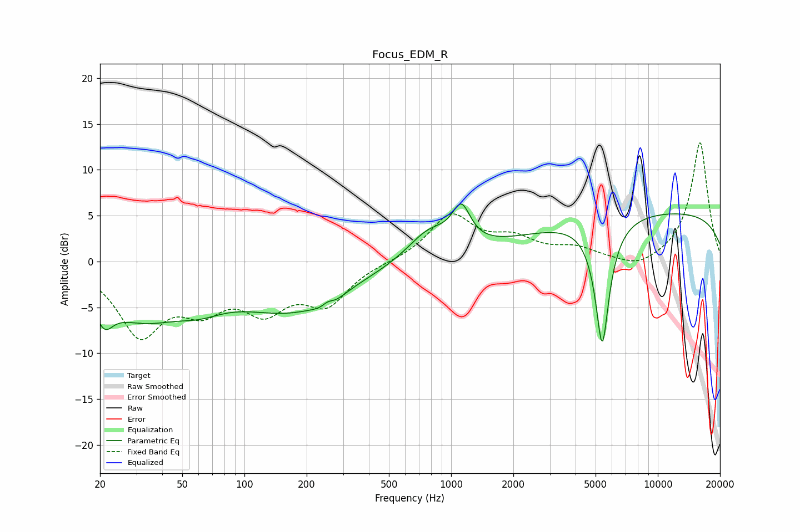

# Focus_EDM_R
See [usage instructions](https://github.com/jaakkopasanen/AutoEq#usage) for more options and info.

### Parametric EQs
Apply preamp of -6.4 dB when using parametric equalizer.

|   # | Type    |   Fc (Hz) |    Q |   Gain (dB) |
|-----|---------|-----------|------|-------------|
|   1 | Peaking |        21 | 3.43 |        -2.8 |
|   2 | Peaking |        31 | 0.67 |        -5.5 |
|   3 | Peaking |        61 | 1.21 |        -1.5 |
|   4 | Peaking |       168 | 0.53 |        -5   |
|   5 | Peaking |       253 | 3.87 |         4.5 |
|   6 | Peaking |       254 | 3.35 |        -4.9 |
|   7 | Peaking |       781 | 1.34 |         3.1 |
|   8 | Peaking |      1120 | 3.21 |         4   |
|   9 | Peaking |      5386 | 3.95 |       -13.8 |
|  10 | Peaking |     10000 | 0.18 |         5.5 |

### Fixed Band EQs
When using fixed band (also called graphic) equalizer, apply preamp of **-13.1 dB** (if available) and set gains manually with these parameters.

|   # | Type    |   Fc (Hz) |    Q |   Gain (dB) |
|-----|---------|-----------|------|-------------|
|   1 | Peaking |        31 | 1.41 |        -7.6 |
|   2 | Peaking |        62 | 1.41 |        -4   |
|   3 | Peaking |       125 | 1.41 |        -4.5 |
|   4 | Peaking |       250 | 1.41 |        -4.2 |
|   5 | Peaking |       500 | 1.41 |        -0   |
|   6 | Peaking |      1000 | 1.41 |         5   |
|   7 | Peaking |      2000 | 1.41 |         2.1 |
|   8 | Peaking |      4000 | 1.41 |         1.2 |
|   9 | Peaking |      8000 | 1.41 |        -1   |
|  10 | Peaking |     16000 | 1.41 |        13.1 |

### Graphs

