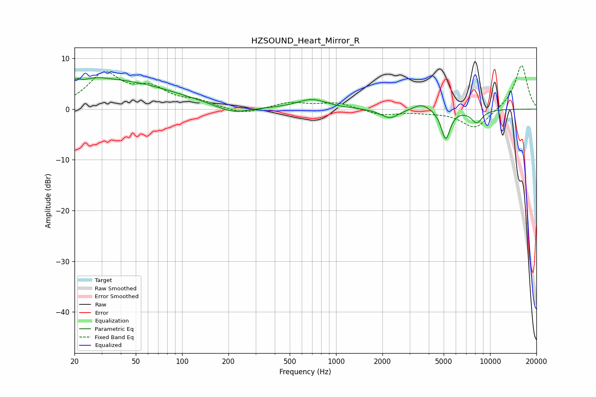

# HZSOUND_Heart_Mirror_R
See [usage instructions](https://github.com/jaakkopasanen/AutoEq#usage) for more options and info.

### Parametric EQs
Apply preamp of -6.3 dB when using parametric equalizer.

|   # | Type    |   Fc (Hz) |    Q |   Gain (dB) |
|-----|---------|-----------|------|-------------|
|   1 | Peaking |        20 | 5.98 |        -2   |
|   2 | Peaking |        20 | 5.99 |         3.1 |
|   3 | Peaking |        26 | 1.43 |         1.5 |
|   4 | Peaking |        41 | 0.41 |         5.2 |
|   5 | Peaking |       213 | 1.38 |        -1.5 |
|   6 | Peaking |       697 | 1.45 |         1.9 |
|   7 | Peaking |      2238 | 2.41 |        -1.9 |
|   8 | Peaking |      3610 | 2.49 |         1.3 |
|   9 | Peaking |      5152 | 4.75 |        -5.9 |
|  10 | Peaking |      8204 | 3.55 |        -2.5 |

### Fixed Band EQs
When using fixed band (also called graphic) equalizer, apply preamp of **-8.6 dB** (if available) and set gains manually with these parameters.

|   # | Type    |   Fc (Hz) |    Q |   Gain (dB) |
|-----|---------|-----------|------|-------------|
|   1 | Peaking |        31 | 1.41 |         6.7 |
|   2 | Peaking |        62 | 1.41 |         3.5 |
|   3 | Peaking |       125 | 1.41 |         1.3 |
|   4 | Peaking |       250 | 1.41 |        -1.1 |
|   5 | Peaking |       500 | 1.41 |         1.2 |
|   6 | Peaking |      1000 | 1.41 |         1.2 |
|   7 | Peaking |      2000 | 1.41 |        -1.2 |
|   8 | Peaking |      4000 | 1.41 |        -0.4 |
|   9 | Peaking |      8000 | 1.41 |        -3.9 |
|  10 | Peaking |     16000 | 1.41 |         8.8 |

### Graphs

