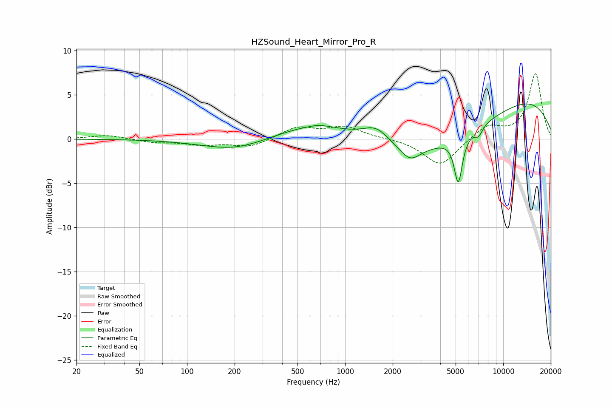

# HZSound_Heart_Mirror_Pro_R
See [usage instructions](https://github.com/jaakkopasanen/AutoEq#usage) for more options and info.

### Parametric EQs
Apply preamp of -4.1 dB when using parametric equalizer.

|   # | Type    |   Fc (Hz) |    Q |   Gain (dB) |
|-----|---------|-----------|------|-------------|
|   1 | Peaking |       151 | 1.04 |         0   |
|   2 | Peaking |       198 | 0.69 |        -1.4 |
|   3 | Peaking |       682 | 2.77 |         0.2 |
|   4 | Peaking |       693 | 0.55 |         2   |
|   5 | Peaking |      1574 | 1.6  |         1.9 |
|   6 | Peaking |      2581 | 2.27 |        -1.5 |
|   7 | Peaking |      4274 | 0.33 |        -4.5 |
|   8 | Peaking |      5201 | 5.46 |        -5.2 |
|   9 | Peaking |      6990 | 5.53 |        -1   |
|  10 | Peaking |     10000 | 0.26 |         5.9 |

### Fixed Band EQs
When using fixed band (also called graphic) equalizer, apply preamp of **-7.5 dB** (if available) and set gains manually with these parameters.

|   # | Type    |   Fc (Hz) |    Q |   Gain (dB) |
|-----|---------|-----------|------|-------------|
|   1 | Peaking |        31 | 1.41 |         0.5 |
|   2 | Peaking |        62 | 1.41 |        -0.4 |
|   3 | Peaking |       125 | 1.41 |        -0.6 |
|   4 | Peaking |       250 | 1.41 |        -0.9 |
|   5 | Peaking |       500 | 1.41 |         1.3 |
|   6 | Peaking |      1000 | 1.41 |         1.3 |
|   7 | Peaking |      2000 | 1.41 |         0.1 |
|   8 | Peaking |      4000 | 1.41 |        -3.1 |
|   9 | Peaking |      8000 | 1.41 |         1.5 |
|  10 | Peaking |     16000 | 1.41 |         7.4 |

### Graphs

