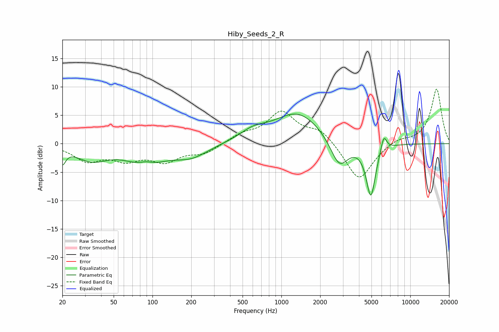

# Hiby_Seeds_2_R
See [usage instructions](https://github.com/jaakkopasanen/AutoEq#usage) for more options and info.

### Parametric EQs
Apply preamp of -5.3 dB when using parametric equalizer.

|   # | Type    |   Fc (Hz) |    Q |   Gain (dB) |
|-----|---------|-----------|------|-------------|
|   1 | Peaking |        20 | 5.78 |        -2.6 |
|   2 | Peaking |        34 | 1.17 |        -2.6 |
|   3 | Peaking |        89 | 0.96 |        -3.4 |
|   4 | Peaking |        89 | 2.44 |         0.9 |
|   5 | Peaking |       200 | 1.07 |        -2.1 |
|   6 | Peaking |       602 | 1.4  |         1.5 |
|   7 | Peaking |      1347 | 0.75 |         5.5 |
|   8 | Peaking |      2813 | 1.99 |        -5.2 |
|   9 | Peaking |      4944 | 3.77 |        -9.3 |
|  10 | Peaking |      6226 | 5.98 |         2.9 |

### Fixed Band EQs
When using fixed band (also called graphic) equalizer, apply preamp of **-9.7 dB** (if available) and set gains manually with these parameters.

|   # | Type    |   Fc (Hz) |    Q |   Gain (dB) |
|-----|---------|-----------|------|-------------|
|   1 | Peaking |        31 | 1.41 |        -2.8 |
|   2 | Peaking |        62 | 1.41 |        -2.4 |
|   3 | Peaking |       125 | 1.41 |        -2.8 |
|   4 | Peaking |       250 | 1.41 |        -1.6 |
|   5 | Peaking |       500 | 1.41 |         1.4 |
|   6 | Peaking |      1000 | 1.41 |         5.3 |
|   7 | Peaking |      2000 | 1.41 |         2.4 |
|   8 | Peaking |      4000 | 1.41 |        -6.7 |
|   9 | Peaking |      8000 | 1.41 |         0.9 |
|  10 | Peaking |     16000 | 1.41 |         9.7 |

### Graphs

