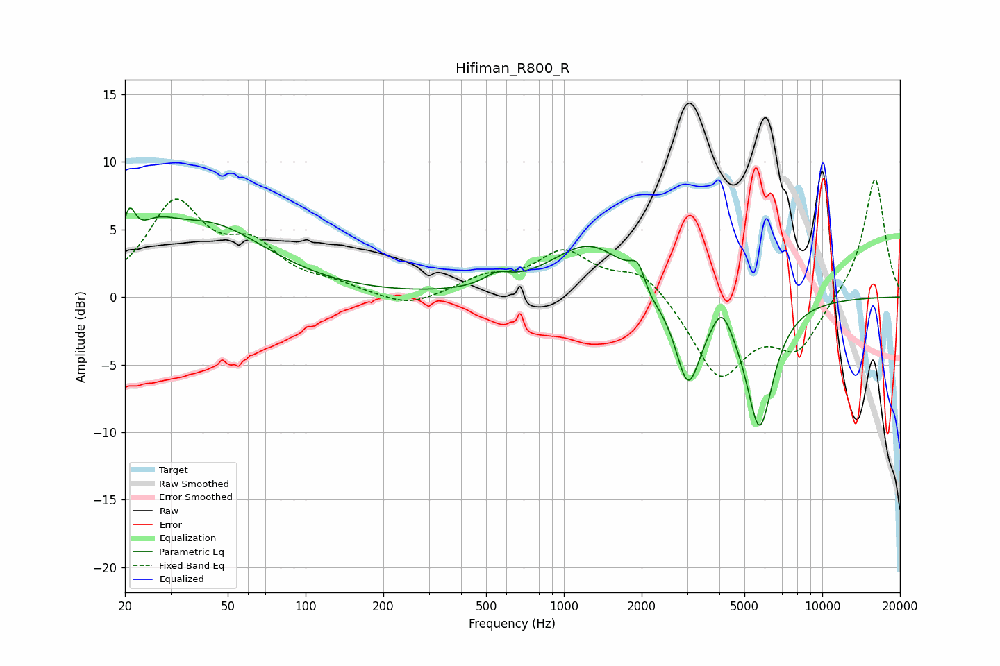

# Hifiman_R800_R
See [usage instructions](https://github.com/jaakkopasanen/AutoEq#usage) for more options and info.

### Parametric EQs
Apply preamp of -6.7 dB when using parametric equalizer.

|   # | Type    |   Fc (Hz) |    Q |   Gain (dB) |
|-----|---------|-----------|------|-------------|
|   1 | Peaking |        21 | 5.99 |         2.8 |
|   2 | Peaking |        26 | 1.83 |         1.8 |
|   3 | Peaking |        42 | 0.61 |         5.1 |
|   4 | Peaking |       551 | 2.81 |         0.8 |
|   5 | Peaking |      1263 | 0.94 |         3.9 |
|   6 | Peaking |      1956 | 4.27 |         2.6 |
|   7 | Peaking |      2067 | 3.24 |        -1.6 |
|   8 | Peaking |      3025 | 2.82 |        -6.5 |
|   9 | Peaking |      4092 | 3.92 |         1.8 |
|  10 | Peaking |      5720 | 2.57 |        -9.5 |

### Fixed Band EQs
When using fixed band (also called graphic) equalizer, apply preamp of **-8.8 dB** (if available) and set gains manually with these parameters.

|   # | Type    |   Fc (Hz) |    Q |   Gain (dB) |
|-----|---------|-----------|------|-------------|
|   1 | Peaking |        31 | 1.41 |         6.6 |
|   2 | Peaking |        62 | 1.41 |         3.2 |
|   3 | Peaking |       125 | 1.41 |         0.7 |
|   4 | Peaking |       250 | 1.41 |        -0.9 |
|   5 | Peaking |       500 | 1.41 |         1.3 |
|   6 | Peaking |      1000 | 1.41 |         3.1 |
|   7 | Peaking |      2000 | 1.41 |         2   |
|   8 | Peaking |      4000 | 1.41 |        -5.9 |
|   9 | Peaking |      8000 | 1.41 |        -3.7 |
|  10 | Peaking |     16000 | 1.41 |         9   |

### Graphs

