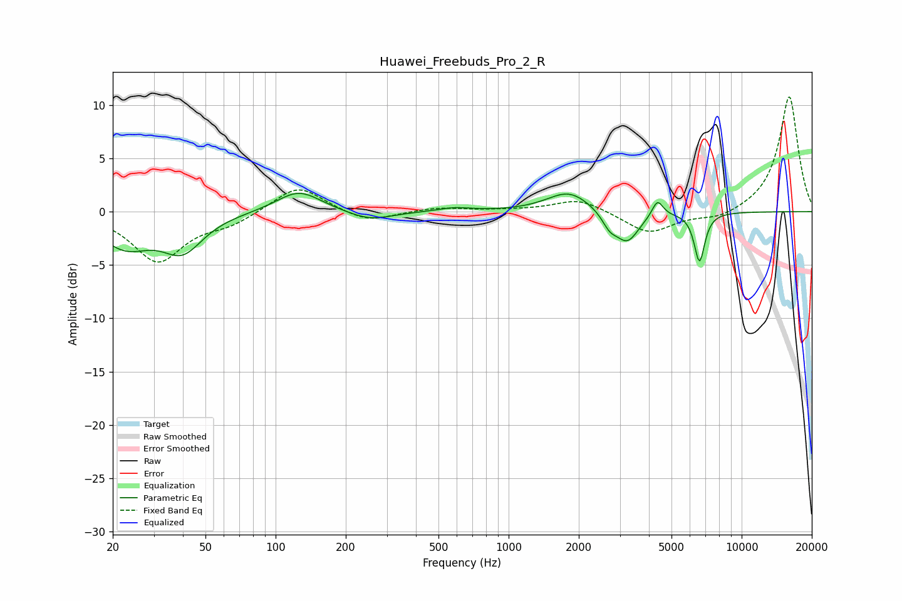

# Huawei_Freebuds_Pro_2_R
See [usage instructions](https://github.com/jaakkopasanen/AutoEq#usage) for more options and info.

### Parametric EQs
Apply preamp of -1.8 dB when using parametric equalizer.

|   # | Type    |   Fc (Hz) |    Q |   Gain (dB) |
|-----|---------|-----------|------|-------------|
|   1 | Peaking |        23 | 1.29 |        -3   |
|   2 | Peaking |        40 | 1.63 |        -3.3 |
|   3 | Peaking |       126 | 1.46 |         2.1 |
|   4 | Peaking |       254 | 1.49 |        -0.9 |
|   5 | Peaking |       585 | 2.1  |         0.3 |
|   6 | Peaking |      1816 | 1.52 |         1.9 |
|   7 | Peaking |      2712 | 4.33 |        -1.2 |
|   8 | Peaking |      3228 | 2.75 |        -2.9 |
|   9 | Peaking |      4354 | 6    |         1.6 |
|  10 | Peaking |      6591 | 6    |        -4.6 |

### Fixed Band EQs
When using fixed band (also called graphic) equalizer, apply preamp of **-10.9 dB** (if available) and set gains manually with these parameters.

|   # | Type    |   Fc (Hz) |    Q |   Gain (dB) |
|-----|---------|-----------|------|-------------|
|   1 | Peaking |        31 | 1.41 |        -4.6 |
|   2 | Peaking |        62 | 1.41 |        -1   |
|   3 | Peaking |       125 | 1.41 |         2.6 |
|   4 | Peaking |       250 | 1.41 |        -1.1 |
|   5 | Peaking |       500 | 1.41 |         0.4 |
|   6 | Peaking |      1000 | 1.41 |         0.1 |
|   7 | Peaking |      2000 | 1.41 |         1.2 |
|   8 | Peaking |      4000 | 1.41 |        -2.1 |
|   9 | Peaking |      8000 | 1.41 |        -0.7 |
|  10 | Peaking |     16000 | 1.41 |        10.9 |

### Graphs

