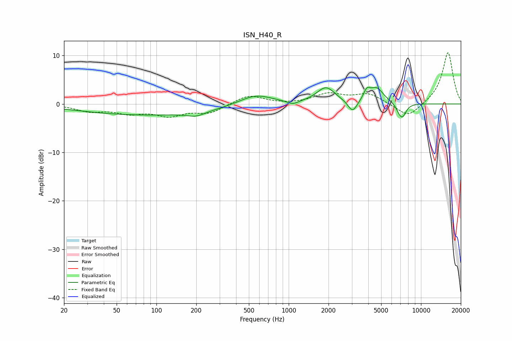

# ISN_H40_R
See [usage instructions](https://github.com/jaakkopasanen/AutoEq#usage) for more options and info.

### Parametric EQs
Apply preamp of -3.5 dB when using parametric equalizer.

|   # | Type    |   Fc (Hz) |    Q |   Gain (dB) |
|-----|---------|-----------|------|-------------|
|   1 | Peaking |        86 | 0.26 |        -2.3 |
|   2 | Peaking |       200 | 2.04 |        -0.9 |
|   3 | Peaking |       561 | 1.12 |         2.2 |
|   4 | Peaking |      1071 | 3.34 |        -0.8 |
|   5 | Peaking |      1913 | 2.04 |         3.3 |
|   6 | Peaking |      3042 | 4.05 |        -2.5 |
|   7 | Peaking |      3892 | 5.8  |         1.8 |
|   8 | Peaking |      4606 | 2.57 |         3.1 |
|   9 | Peaking |      6848 | 5.44 |        -1.1 |
|  10 | Peaking |      7273 | 4.83 |        -2.4 |

### Fixed Band EQs
When using fixed band (also called graphic) equalizer, apply preamp of **-10.7 dB** (if available) and set gains manually with these parameters.

|   # | Type    |   Fc (Hz) |    Q |   Gain (dB) |
|-----|---------|-----------|------|-------------|
|   1 | Peaking |        31 | 1.41 |        -1.4 |
|   2 | Peaking |        62 | 1.41 |        -1.6 |
|   3 | Peaking |       125 | 1.41 |        -2.2 |
|   4 | Peaking |       250 | 1.41 |        -1.8 |
|   5 | Peaking |       500 | 1.41 |         1.9 |
|   6 | Peaking |      1000 | 1.41 |        -0.1 |
|   7 | Peaking |      2000 | 1.41 |         2   |
|   8 | Peaking |      4000 | 1.41 |         2   |
|   9 | Peaking |      8000 | 1.41 |        -3   |
|  10 | Peaking |     16000 | 1.41 |        10.8 |

### Graphs

