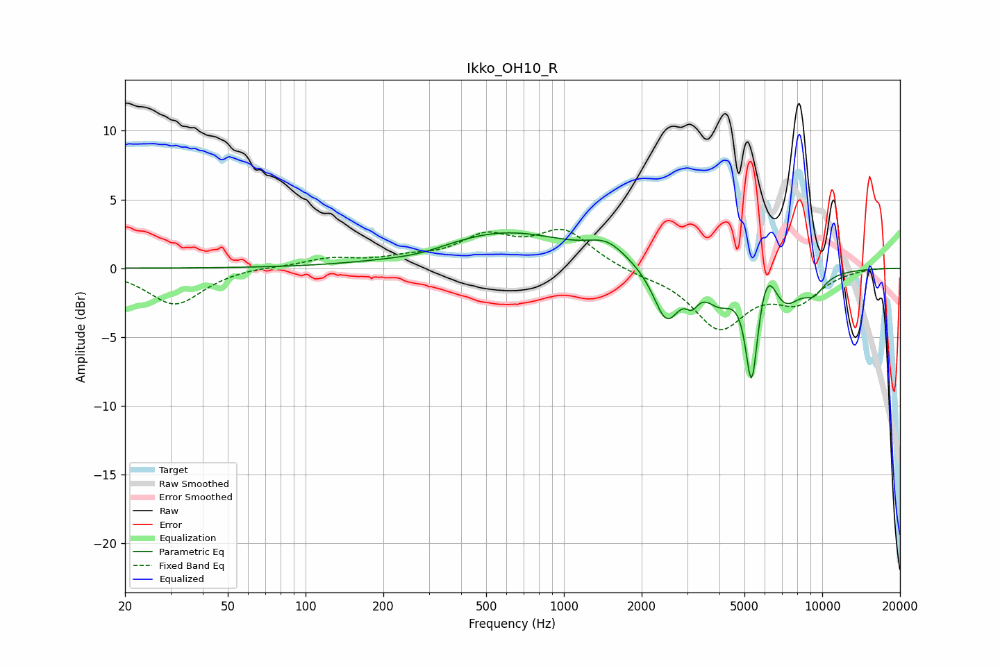

# Ikko_OH10_R
See [usage instructions](https://github.com/jaakkopasanen/AutoEq#usage) for more options and info.

### Parametric EQs
Apply preamp of -2.7 dB when using parametric equalizer.

|   # | Type    |   Fc (Hz) |    Q |   Gain (dB) |
|-----|---------|-----------|------|-------------|
|   1 | Peaking |       279 | 1.17 |        -0.4 |
|   2 | Peaking |       588 | 0.53 |         2.6 |
|   3 | Peaking |      1469 | 1.92 |         1.2 |
|   4 | Peaking |      2494 | 2.8  |        -3.8 |
|   5 | Peaking |      3133 | 6    |        -1.1 |
|   6 | Peaking |      4007 | 2.51 |        -1.9 |
|   7 | Peaking |      5330 | 5.85 |        -7.5 |
|   8 | Peaking |      6140 | 3.74 |         2.5 |
|   9 | Peaking |      7114 | 2.06 |        -2.5 |
|  10 | Peaking |      9294 | 3.04 |        -1.2 |

### Fixed Band EQs
When using fixed band (also called graphic) equalizer, apply preamp of **-2.9 dB** (if available) and set gains manually with these parameters.

|   # | Type    |   Fc (Hz) |    Q |   Gain (dB) |
|-----|---------|-----------|------|-------------|
|   1 | Peaking |        31 | 1.41 |        -2.7 |
|   2 | Peaking |        62 | 1.41 |         0.1 |
|   3 | Peaking |       125 | 1.41 |         0.6 |
|   4 | Peaking |       250 | 1.41 |         0.6 |
|   5 | Peaking |       500 | 1.41 |         2.1 |
|   6 | Peaking |      1000 | 1.41 |         2.6 |
|   7 | Peaking |      2000 | 1.41 |        -0.4 |
|   8 | Peaking |      4000 | 1.41 |        -4.2 |
|   9 | Peaking |      8000 | 1.41 |        -2.2 |
|  10 | Peaking |     16000 | 1.41 |         0.1 |

### Graphs

