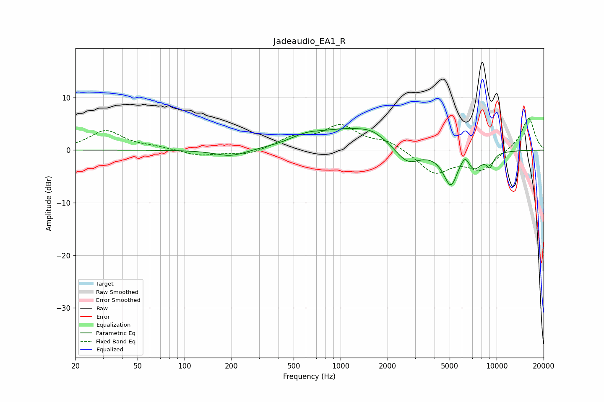

# Jadeaudio_EA1_R
See [usage instructions](https://github.com/jaakkopasanen/AutoEq#usage) for more options and info.

### Parametric EQs
Apply preamp of -4.2 dB when using parametric equalizer.

|   # | Type    |   Fc (Hz) |    Q |   Gain (dB) |
|-----|---------|-----------|------|-------------|
|   1 | Peaking |       198 | 1.39 |        -1.3 |
|   2 | Peaking |       600 | 1.36 |         1.4 |
|   3 | Peaking |      1232 | 0.62 |         4   |
|   4 | Peaking |      1605 | 2.19 |         0.7 |
|   5 | Peaking |      2681 | 1.72 |        -3.6 |
|   6 | Peaking |      5109 | 2.8  |        -6.9 |
|   7 | Peaking |      5700 | 3.48 |         1   |
|   8 | Peaking |      6295 | 5.3  |         1.9 |
|   9 | Peaking |      7187 | 2.64 |        -3   |
|  10 | Peaking |      9054 | 5.79 |        -2.3 |

### Fixed Band EQs
When using fixed band (also called graphic) equalizer, apply preamp of **-6.1 dB** (if available) and set gains manually with these parameters.

|   # | Type    |   Fc (Hz) |    Q |   Gain (dB) |
|-----|---------|-----------|------|-------------|
|   1 | Peaking |        31 | 1.41 |         3.7 |
|   2 | Peaking |        62 | 1.41 |         0.5 |
|   3 | Peaking |       125 | 1.41 |        -1.1 |
|   4 | Peaking |       250 | 1.41 |        -1   |
|   5 | Peaking |       500 | 1.41 |         2.2 |
|   6 | Peaking |      1000 | 1.41 |         4.4 |
|   7 | Peaking |      2000 | 1.41 |         1.6 |
|   8 | Peaking |      4000 | 1.41 |        -4.3 |
|   9 | Peaking |      8000 | 1.41 |        -3.6 |
|  10 | Peaking |     16000 | 1.41 |         6.3 |

### Graphs

