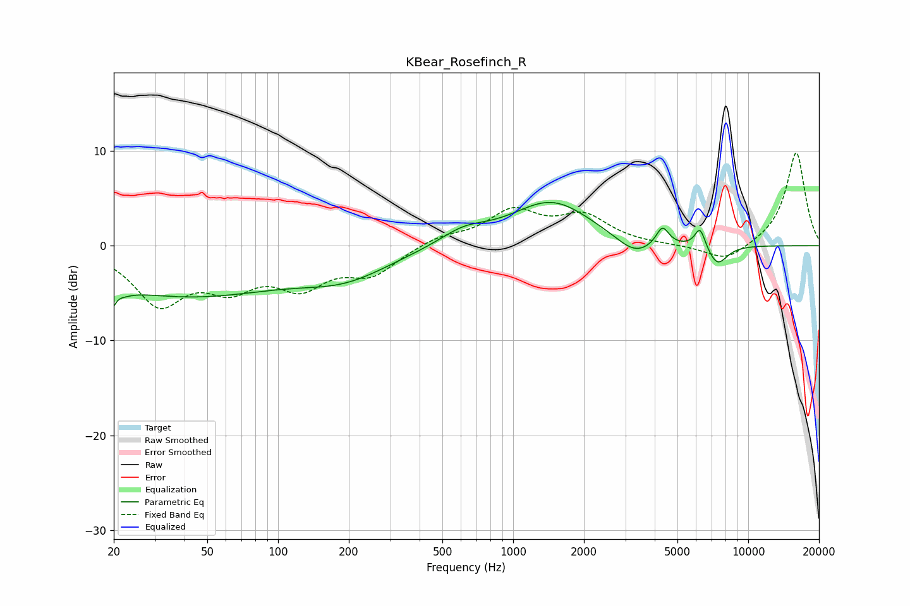

# KBear_Rosefinch_R
See [usage instructions](https://github.com/jaakkopasanen/AutoEq#usage) for more options and info.

### Parametric EQs
Apply preamp of -4.7 dB when using parametric equalizer.

|   # | Type    |   Fc (Hz) |    Q |   Gain (dB) |
|-----|---------|-----------|------|-------------|
|   1 | Peaking |        20 | 4.5  |        -5.4 |
|   2 | Peaking |        20 | 5.45 |         3.4 |
|   3 | Peaking |        40 | 0.33 |        -5.1 |
|   4 | Peaking |       194 | 0.72 |        -2.6 |
|   5 | Peaking |       614 | 1.38 |         1.4 |
|   6 | Peaking |      1457 | 0.82 |         4.7 |
|   7 | Peaking |      3291 | 1.73 |        -1.9 |
|   8 | Peaking |      4315 | 5.17 |         2   |
|   9 | Peaking |      6239 | 6    |         2.2 |
|  10 | Peaking |      7393 | 3.16 |        -2.2 |

### Fixed Band EQs
When using fixed band (also called graphic) equalizer, apply preamp of **-9.9 dB** (if available) and set gains manually with these parameters.

|   # | Type    |   Fc (Hz) |    Q |   Gain (dB) |
|-----|---------|-----------|------|-------------|
|   1 | Peaking |        31 | 1.41 |        -5.8 |
|   2 | Peaking |        62 | 1.41 |        -3.6 |
|   3 | Peaking |       125 | 1.41 |        -3.7 |
|   4 | Peaking |       250 | 1.41 |        -2.8 |
|   5 | Peaking |       500 | 1.41 |         0.9 |
|   6 | Peaking |      1000 | 1.41 |         3.5 |
|   7 | Peaking |      2000 | 1.41 |         2.9 |
|   8 | Peaking |      4000 | 1.41 |         0   |
|   9 | Peaking |      8000 | 1.41 |        -1.8 |
|  10 | Peaking |     16000 | 1.41 |         9.9 |

### Graphs

