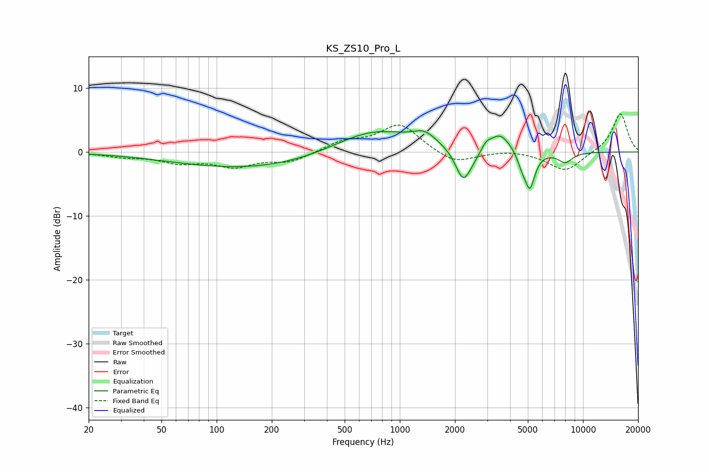

# KS_ZS10_Pro_L
See [usage instructions](https://github.com/jaakkopasanen/AutoEq#usage) for more options and info.

### Parametric EQs
Apply preamp of -3.4 dB when using parametric equalizer.

|   # | Type    |   Fc (Hz) |    Q |   Gain (dB) |
|-----|---------|-----------|------|-------------|
|   1 | Peaking |       154 | 0.33 |        -2.6 |
|   2 | Peaking |       712 | 0.66 |         3.8 |
|   3 | Peaking |      1366 | 2.21 |         1.8 |
|   4 | Peaking |      2207 | 3.48 |        -4.6 |
|   5 | Peaking |      2448 | 2.9  |        -1.2 |
|   6 | Peaking |      2962 | 5.58 |         1   |
|   7 | Peaking |      3522 | 2.44 |         2.9 |
|   8 | Peaking |      4631 | 5.98 |        -1.5 |
|   9 | Peaking |      5124 | 4.96 |        -5.7 |
|  10 | Peaking |      7998 | 3.4  |        -1.6 |

### Fixed Band EQs
When using fixed band (also called graphic) equalizer, apply preamp of **-6.0 dB** (if available) and set gains manually with these parameters.

|   # | Type    |   Fc (Hz) |    Q |   Gain (dB) |
|-----|---------|-----------|------|-------------|
|   1 | Peaking |        31 | 1.41 |        -0.6 |
|   2 | Peaking |        62 | 1.41 |        -1.5 |
|   3 | Peaking |       125 | 1.41 |        -2.1 |
|   4 | Peaking |       250 | 1.41 |        -1.5 |
|   5 | Peaking |       500 | 1.41 |         1.5 |
|   6 | Peaking |      1000 | 1.41 |         4.3 |
|   7 | Peaking |      2000 | 1.41 |        -2   |
|   8 | Peaking |      4000 | 1.41 |         0.4 |
|   9 | Peaking |      8000 | 1.41 |        -3.1 |
|  10 | Peaking |     16000 | 1.41 |         6.1 |

### Graphs

