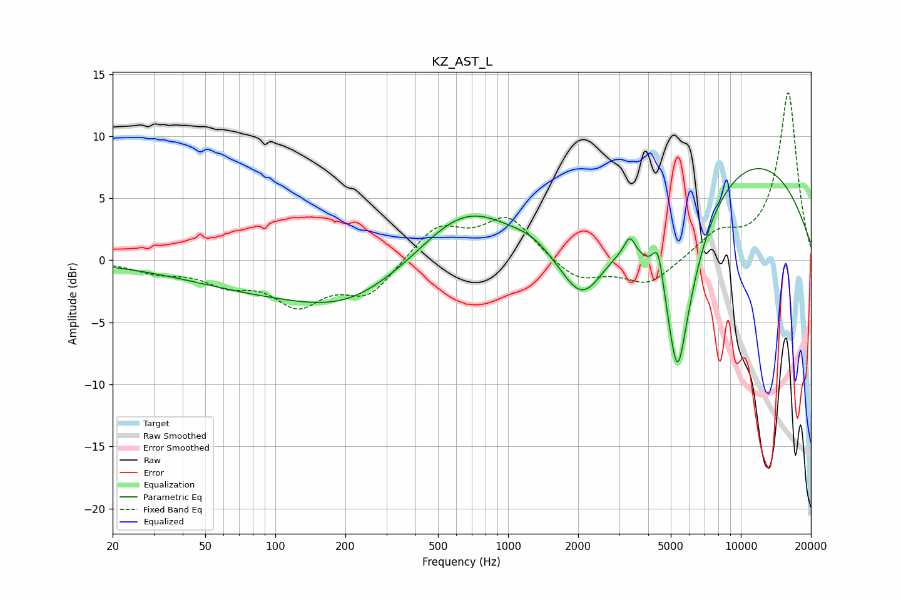

# KZ_AST_L
See [usage instructions](https://github.com/jaakkopasanen/AutoEq#usage) for more options and info.

### Parametric EQs
Apply preamp of -7.5 dB when using parametric equalizer.

|   # | Type    |   Fc (Hz) |    Q |   Gain (dB) |
|-----|---------|-----------|------|-------------|
|   1 | Peaking |       172 | 0.25 |        -3   |
|   2 | Peaking |       202 | 0.73 |        -1.3 |
|   3 | Peaking |       644 | 0.68 |         5.2 |
|   4 | Peaking |      1260 | 2.17 |         0.4 |
|   5 | Peaking |      2084 | 1.37 |        -5.6 |
|   6 | Peaking |      3337 | 6    |         1.5 |
|   7 | Peaking |      4416 | 5.69 |         3.3 |
|   8 | Peaking |      5341 | 4.87 |        -3.7 |
|   9 | Peaking |      5369 | 1.4  |       -13   |
|  10 | Peaking |      8685 | 0.27 |         9.5 |

### Fixed Band EQs
When using fixed band (also called graphic) equalizer, apply preamp of **-13.6 dB** (if available) and set gains manually with these parameters.

|   # | Type    |   Fc (Hz) |    Q |   Gain (dB) |
|-----|---------|-----------|------|-------------|
|   1 | Peaking |        31 | 1.41 |        -0.8 |
|   2 | Peaking |        62 | 1.41 |        -1.6 |
|   3 | Peaking |       125 | 1.41 |        -3.2 |
|   4 | Peaking |       250 | 1.41 |        -2.7 |
|   5 | Peaking |       500 | 1.41 |         2.7 |
|   6 | Peaking |      1000 | 1.41 |         3.4 |
|   7 | Peaking |      2000 | 1.41 |        -1.7 |
|   8 | Peaking |      4000 | 1.41 |        -2   |
|   9 | Peaking |      8000 | 1.41 |         1.9 |
|  10 | Peaking |     16000 | 1.41 |        13.5 |

### Graphs

