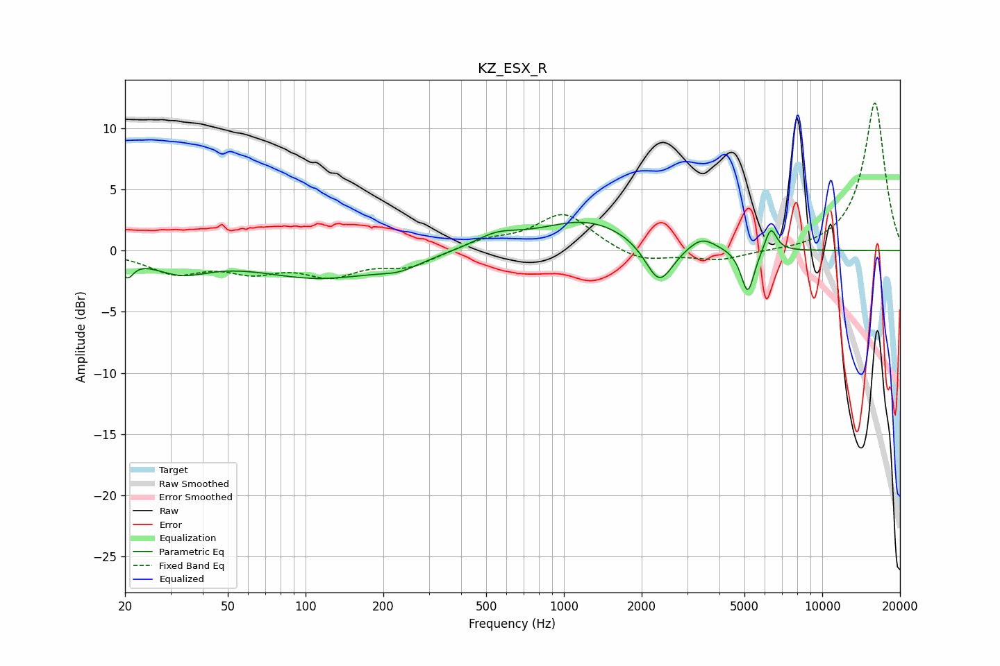

# KZ_ESX_R
See [usage instructions](https://github.com/jaakkopasanen/AutoEq#usage) for more options and info.

### Parametric EQs
Apply preamp of -2.4 dB when using parametric equalizer.

|   # | Type    |   Fc (Hz) |    Q |   Gain (dB) |
|-----|---------|-----------|------|-------------|
|   1 | Peaking |        20 | 6    |        -1.5 |
|   2 | Peaking |        33 | 1.29 |        -1.5 |
|   3 | Peaking |       114 | 0.58 |        -2.2 |
|   4 | Peaking |       232 | 1.7  |        -0.7 |
|   5 | Peaking |       548 | 1.59 |         1   |
|   6 | Peaking |      1226 | 0.77 |         2.5 |
|   7 | Peaking |      2339 | 2.62 |        -3.5 |
|   8 | Peaking |      3420 | 2.7  |         1   |
|   9 | Peaking |      5147 | 5.39 |        -3.7 |
|  10 | Peaking |      6321 | 6    |         2   |

### Fixed Band EQs
When using fixed band (also called graphic) equalizer, apply preamp of **-12.2 dB** (if available) and set gains manually with these parameters.

|   # | Type    |   Fc (Hz) |    Q |   Gain (dB) |
|-----|---------|-----------|------|-------------|
|   1 | Peaking |        31 | 1.41 |        -1.7 |
|   2 | Peaking |        62 | 1.41 |        -1.4 |
|   3 | Peaking |       125 | 1.41 |        -1.8 |
|   4 | Peaking |       250 | 1.41 |        -1.2 |
|   5 | Peaking |       500 | 1.41 |         0.8 |
|   6 | Peaking |      1000 | 1.41 |         3   |
|   7 | Peaking |      2000 | 1.41 |        -1   |
|   8 | Peaking |      4000 | 1.41 |        -0.8 |
|   9 | Peaking |      8000 | 1.41 |        -0.1 |
|  10 | Peaking |     16000 | 1.41 |        12.2 |

### Graphs

