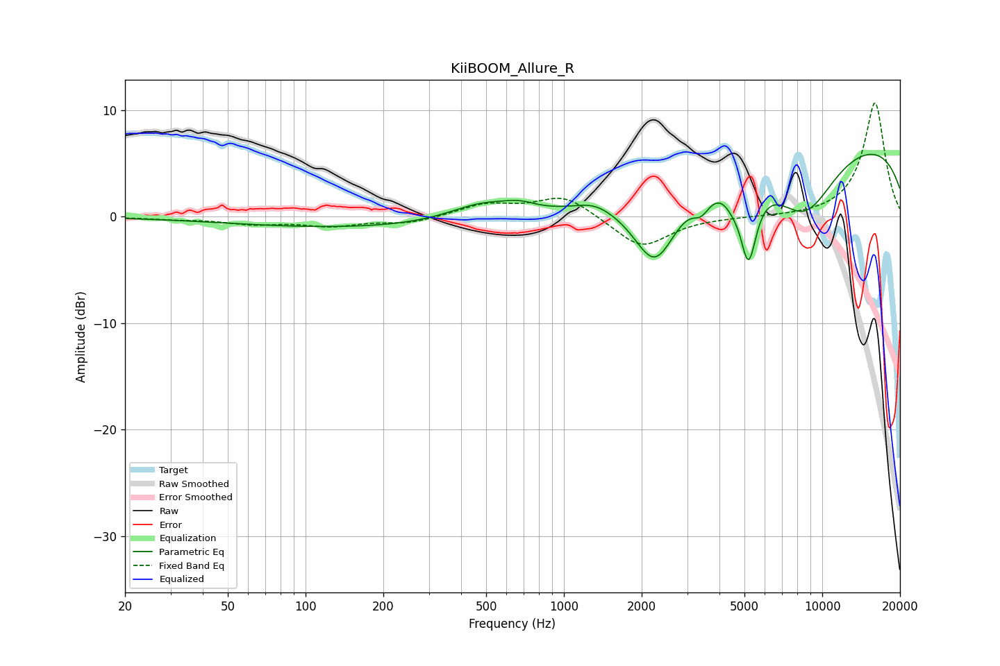

# KiiBOOM_Allure_R
See [usage instructions](https://github.com/jaakkopasanen/AutoEq#usage) for more options and info.

### Parametric EQs
Apply preamp of -6.0 dB when using parametric equalizer.

|   # | Type    |   Fc (Hz) |    Q |   Gain (dB) |
|-----|---------|-----------|------|-------------|
|   1 | Peaking |       203 | 0.23 |        -1.1 |
|   2 | Peaking |       487 | 1.02 |         1.8 |
|   3 | Peaking |       677 | 2.37 |         0.6 |
|   4 | Peaking |      1308 | 1.97 |         0.8 |
|   5 | Peaking |      2255 | 1.61 |        -7.3 |
|   6 | Peaking |      3402 | 4.19 |        -1.6 |
|   7 | Peaking |      4485 | 4.72 |        -0.8 |
|   8 | Peaking |      5179 | 4.3  |        -7.3 |
|   9 | Peaking |      8535 | 1    |        -6.7 |
|  10 | Peaking |     10000 | 0.18 |         7.8 |

### Fixed Band EQs
When using fixed band (also called graphic) equalizer, apply preamp of **-10.8 dB** (if available) and set gains manually with these parameters.

|   # | Type    |   Fc (Hz) |    Q |   Gain (dB) |
|-----|---------|-----------|------|-------------|
|   1 | Peaking |        31 | 1.41 |        -0.2 |
|   2 | Peaking |        62 | 1.41 |        -0.6 |
|   3 | Peaking |       125 | 1.41 |        -0.8 |
|   4 | Peaking |       250 | 1.41 |        -0.6 |
|   5 | Peaking |       500 | 1.41 |         1.1 |
|   6 | Peaking |      1000 | 1.41 |         2   |
|   7 | Peaking |      2000 | 1.41 |        -3   |
|   8 | Peaking |      4000 | 1.41 |        -0   |
|   9 | Peaking |      8000 | 1.41 |        -0   |
|  10 | Peaking |     16000 | 1.41 |        10.8 |

### Graphs

