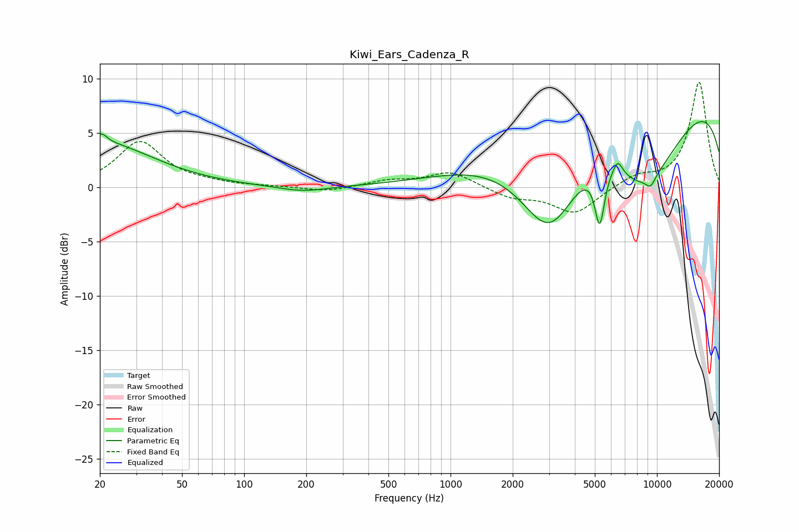

# Kiwi_Ears_Cadenza_R
See [usage instructions](https://github.com/jaakkopasanen/AutoEq#usage) for more options and info.

### Parametric EQs
Apply preamp of -6.2 dB when using parametric equalizer.

|   # | Type    |   Fc (Hz) |    Q |   Gain (dB) |
|-----|---------|-----------|------|-------------|
|   1 | Peaking |        20 | 0.56 |         4.1 |
|   2 | Peaking |        20 | 5.62 |         0.8 |
|   3 | Peaking |       193 | 1.21 |        -0.5 |
|   4 | Peaking |      3016 | 0.91 |        -9.3 |
|   5 | Peaking |      5279 | 5.77 |        -5.4 |
|   6 | Peaking |      5348 | 0.99 |         2.3 |
|   7 | Peaking |      6458 | 5.93 |         1.3 |
|   8 | Peaking |      8533 | 0.53 |       -11.1 |
|   9 | Peaking |      9041 | 0.18 |        12.3 |
|  10 | Peaking |      9322 | 5.47 |        -0.9 |

### Fixed Band EQs
When using fixed band (also called graphic) equalizer, apply preamp of **-9.8 dB** (if available) and set gains manually with these parameters.

|   # | Type    |   Fc (Hz) |    Q |   Gain (dB) |
|-----|---------|-----------|------|-------------|
|   1 | Peaking |        31 | 1.41 |         4.2 |
|   2 | Peaking |        62 | 1.41 |         0.3 |
|   3 | Peaking |       125 | 1.41 |         0.1 |
|   4 | Peaking |       250 | 1.41 |        -0.4 |
|   5 | Peaking |       500 | 1.41 |         0.6 |
|   6 | Peaking |      1000 | 1.41 |         1.4 |
|   7 | Peaking |      2000 | 1.41 |        -0.9 |
|   8 | Peaking |      4000 | 1.41 |        -2.4 |
|   9 | Peaking |      8000 | 1.41 |         1   |
|  10 | Peaking |     16000 | 1.41 |         9.7 |

### Graphs

