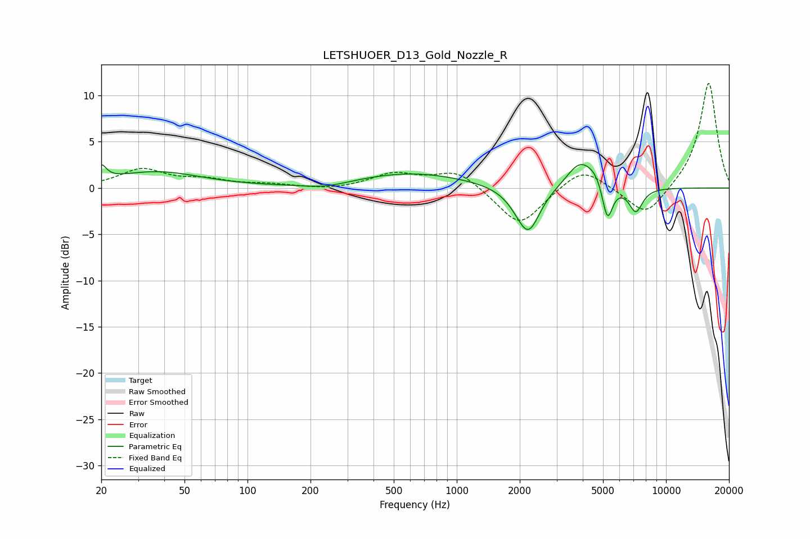

# LETSHUOER_D13_Gold_Nozzle_R
See [usage instructions](https://github.com/jaakkopasanen/AutoEq#usage) for more options and info.

### Parametric EQs
Apply preamp of -2.6 dB when using parametric equalizer.

|   # | Type    |   Fc (Hz) |    Q |   Gain (dB) |
|-----|---------|-----------|------|-------------|
|   1 | Peaking |        20 | 5.95 |         1.5 |
|   2 | Peaking |        37 | 0.67 |         1.7 |
|   3 | Peaking |       235 | 1.29 |        -0.5 |
|   4 | Peaking |       606 | 0.53 |         1.6 |
|   5 | Peaking |      1989 | 2.16 |        -0.8 |
|   6 | Peaking |      2206 | 2.6  |        -4.5 |
|   7 | Peaking |      3867 | 2.2  |         2.8 |
|   8 | Peaking |      4623 | 3.18 |         1.1 |
|   9 | Peaking |      5246 | 5.53 |        -4.1 |
|  10 | Peaking |      7171 | 4.15 |        -2.6 |

### Fixed Band EQs
When using fixed band (also called graphic) equalizer, apply preamp of **-11.4 dB** (if available) and set gains manually with these parameters.

|   # | Type    |   Fc (Hz) |    Q |   Gain (dB) |
|-----|---------|-----------|------|-------------|
|   1 | Peaking |        31 | 1.41 |         2   |
|   2 | Peaking |        62 | 1.41 |         0.8 |
|   3 | Peaking |       125 | 1.41 |         0.3 |
|   4 | Peaking |       250 | 1.41 |        -0.2 |
|   5 | Peaking |       500 | 1.41 |         1.5 |
|   6 | Peaking |      1000 | 1.41 |         1.9 |
|   7 | Peaking |      2000 | 1.41 |        -4.2 |
|   8 | Peaking |      4000 | 1.41 |         2.4 |
|   9 | Peaking |      8000 | 1.41 |        -3.3 |
|  10 | Peaking |     16000 | 1.41 |        11.5 |

### Graphs

