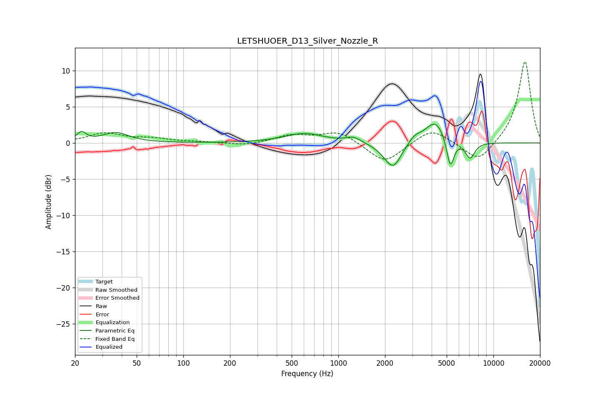

# LETSHUOER_D13_Silver_Nozzle_R
See [usage instructions](https://github.com/jaakkopasanen/AutoEq#usage) for more options and info.

### Parametric EQs
Apply preamp of -2.7 dB when using parametric equalizer.

|   # | Type    |   Fc (Hz) |    Q |   Gain (dB) |
|-----|---------|-----------|------|-------------|
|   1 | Peaking |        22 | 4.75 |         1.3 |
|   2 | Peaking |        37 | 1.7  |         1.4 |
|   3 | Peaking |       604 | 1.14 |         1.3 |
|   4 | Peaking |      1251 | 3    |         0.7 |
|   5 | Peaking |      2055 | 2.11 |        -0.6 |
|   6 | Peaking |      2264 | 2.71 |        -3.1 |
|   7 | Peaking |      3110 | 3.71 |         0.9 |
|   8 | Peaking |      4236 | 2.09 |         3.2 |
|   9 | Peaking |      5277 | 5.73 |        -4.2 |
|  10 | Peaking |      7083 | 4.49 |        -2.3 |

### Fixed Band EQs
When using fixed band (also called graphic) equalizer, apply preamp of **-11.3 dB** (if available) and set gains manually with these parameters.

|   # | Type    |   Fc (Hz) |    Q |   Gain (dB) |
|-----|---------|-----------|------|-------------|
|   1 | Peaking |        31 | 1.41 |         1.3 |
|   2 | Peaking |        62 | 1.41 |         0.5 |
|   3 | Peaking |       125 | 1.41 |         0.1 |
|   4 | Peaking |       250 | 1.41 |        -0.4 |
|   5 | Peaking |       500 | 1.41 |         1   |
|   6 | Peaking |      1000 | 1.41 |         1.6 |
|   7 | Peaking |      2000 | 1.41 |        -2.9 |
|   8 | Peaking |      4000 | 1.41 |         2.1 |
|   9 | Peaking |      8000 | 1.41 |        -2.8 |
|  10 | Peaking |     16000 | 1.41 |        11.4 |

### Graphs

