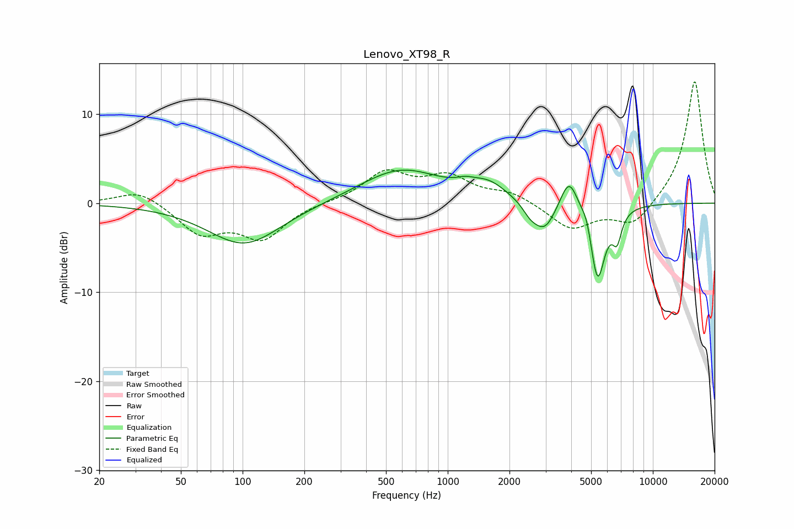

# Lenovo_XT98_R
See [usage instructions](https://github.com/jaakkopasanen/AutoEq#usage) for more options and info.

### Parametric EQs
Apply preamp of -3.8 dB when using parametric equalizer.

|   # | Type    |   Fc (Hz) |    Q |   Gain (dB) |
|-----|---------|-----------|------|-------------|
|   1 | Peaking |       102 | 0.8  |        -4.7 |
|   2 | Peaking |       589 | 0.71 |         3.8 |
|   3 | Peaking |      1216 | 3.38 |         0.5 |
|   4 | Peaking |      1576 | 1.57 |         1.8 |
|   5 | Peaking |      2521 | 3.87 |        -1   |
|   6 | Peaking |      2963 | 2.53 |        -3.3 |
|   7 | Peaking |      3909 | 3.25 |         3.8 |
|   8 | Peaking |      4766 | 6    |         1.4 |
|   9 | Peaking |      5374 | 3.74 |        -8.8 |
|  10 | Peaking |      6687 | 6    |        -3   |

### Fixed Band EQs
When using fixed band (also called graphic) equalizer, apply preamp of **-13.7 dB** (if available) and set gains manually with these parameters.

|   # | Type    |   Fc (Hz) |    Q |   Gain (dB) |
|-----|---------|-----------|------|-------------|
|   1 | Peaking |        31 | 1.41 |         1.6 |
|   2 | Peaking |        62 | 1.41 |        -3.3 |
|   3 | Peaking |       125 | 1.41 |        -3.8 |
|   4 | Peaking |       250 | 1.41 |         0.1 |
|   5 | Peaking |       500 | 1.41 |         3.3 |
|   6 | Peaking |      1000 | 1.41 |         2.7 |
|   7 | Peaking |      2000 | 1.41 |         1.1 |
|   8 | Peaking |      4000 | 1.41 |        -2.9 |
|   9 | Peaking |      8000 | 1.41 |        -2.6 |
|  10 | Peaking |     16000 | 1.41 |        13.9 |

### Graphs

