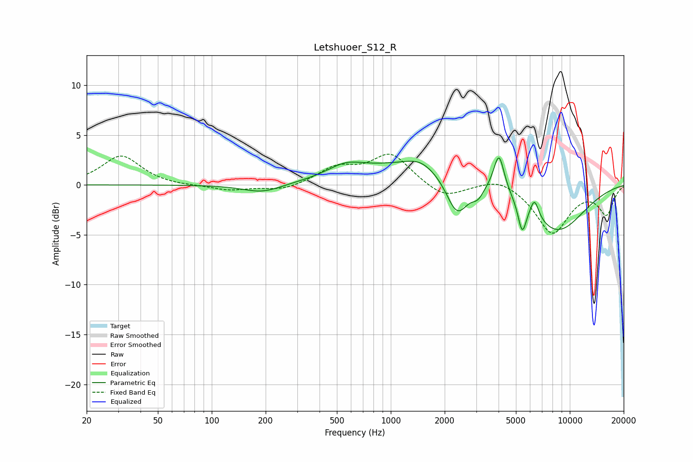

# Letshuoer_S12_R
See [usage instructions](https://github.com/jaakkopasanen/AutoEq#usage) for more options and info.

### Parametric EQs
Apply preamp of -2.8 dB when using parametric equalizer.

|   # | Type    |   Fc (Hz) |    Q |   Gain (dB) |
|-----|---------|-----------|------|-------------|
|   1 | Peaking |       192 | 1.27 |        -0.9 |
|   2 | Peaking |       558 | 1.39 |         1.2 |
|   3 | Peaking |      1447 | 1.95 |         0.7 |
|   4 | Peaking |      1696 | 0.38 |         2.5 |
|   5 | Peaking |      2348 | 2.18 |        -4.4 |
|   6 | Peaking |      3071 | 3.97 |        -1.2 |
|   7 | Peaking |      4021 | 4.91 |         3.7 |
|   8 | Peaking |      5421 | 6    |        -3   |
|   9 | Peaking |      6353 | 5.8  |         1.9 |
|  10 | Peaking |      8351 | 0.78 |        -4.9 |

### Fixed Band EQs
When using fixed band (also called graphic) equalizer, apply preamp of **-3.2 dB** (if available) and set gains manually with these parameters.

|   # | Type    |   Fc (Hz) |    Q |   Gain (dB) |
|-----|---------|-----------|------|-------------|
|   1 | Peaking |        31 | 1.41 |         2.9 |
|   2 | Peaking |        62 | 1.41 |        -0.1 |
|   3 | Peaking |       125 | 1.41 |        -0.5 |
|   4 | Peaking |       250 | 1.41 |        -0.6 |
|   5 | Peaking |       500 | 1.41 |         1.6 |
|   6 | Peaking |      1000 | 1.41 |         3   |
|   7 | Peaking |      2000 | 1.41 |        -1.4 |
|   8 | Peaking |      4000 | 1.41 |         0.9 |
|   9 | Peaking |      8000 | 1.41 |        -4.8 |
|  10 | Peaking |     16000 | 1.41 |        -2.8 |

### Graphs

