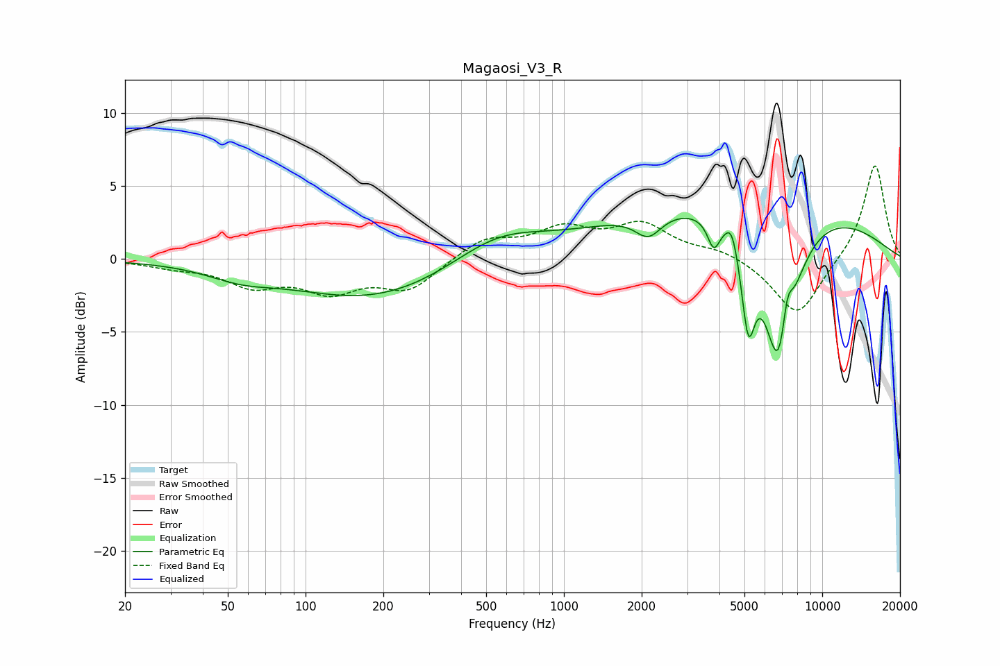

# Magaosi_V3_R
See [usage instructions](https://github.com/jaakkopasanen/AutoEq#usage) for more options and info.

### Parametric EQs
Apply preamp of -2.9 dB when using parametric equalizer.

|   # | Type    |   Fc (Hz) |    Q |   Gain (dB) |
|-----|---------|-----------|------|-------------|
|   1 | Peaking |        56 | 1.09 |        -0.8 |
|   2 | Peaking |       186 | 0.44 |        -2.8 |
|   3 | Peaking |       553 | 0.77 |         2   |
|   4 | Peaking |      2123 | 2.75 |        -1.6 |
|   5 | Peaking |      3801 | 5.95 |        -1.9 |
|   6 | Peaking |      4466 | 5.98 |         1.4 |
|   7 | Peaking |      5172 | 5.29 |        -5.9 |
|   8 | Peaking |      5292 | 0.26 |         4.5 |
|   9 | Peaking |      6833 | 2.15 |       -11.5 |
|  10 | Peaking |      7310 | 5.99 |         3.2 |

### Fixed Band EQs
When using fixed band (also called graphic) equalizer, apply preamp of **-6.5 dB** (if available) and set gains manually with these parameters.

|   # | Type    |   Fc (Hz) |    Q |   Gain (dB) |
|-----|---------|-----------|------|-------------|
|   1 | Peaking |        31 | 1.41 |        -0.4 |
|   2 | Peaking |        62 | 1.41 |        -1.6 |
|   3 | Peaking |       125 | 1.41 |        -2   |
|   4 | Peaking |       250 | 1.41 |        -2   |
|   5 | Peaking |       500 | 1.41 |         1.4 |
|   6 | Peaking |      1000 | 1.41 |         1.8 |
|   7 | Peaking |      2000 | 1.41 |         2.2 |
|   8 | Peaking |      4000 | 1.41 |         0.6 |
|   9 | Peaking |      8000 | 1.41 |        -4   |
|  10 | Peaking |     16000 | 1.41 |         6.6 |

### Graphs

