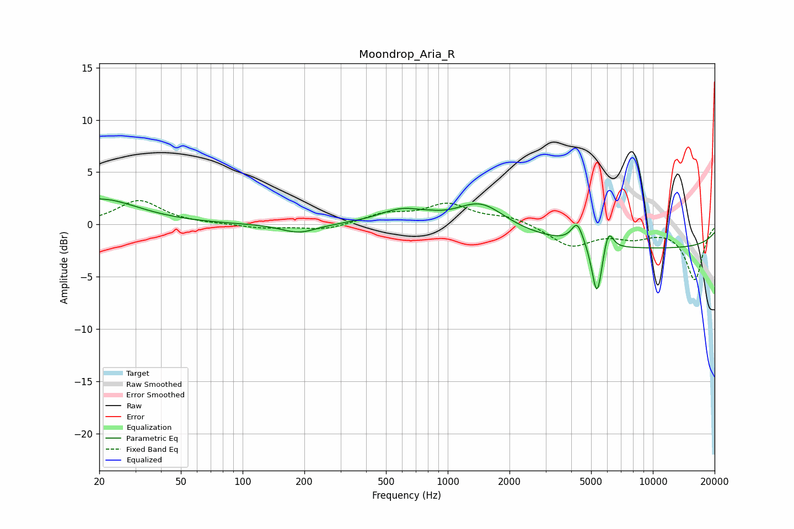

# Moondrop_Aria_R
See [usage instructions](https://github.com/jaakkopasanen/AutoEq#usage) for more options and info.

### Parametric EQs
Apply preamp of -2.5 dB when using parametric equalizer.

|   # | Type    |   Fc (Hz) |    Q |   Gain (dB) |
|-----|---------|-----------|------|-------------|
|   1 | Peaking |        20 | 0.76 |         2.4 |
|   2 | Peaking |       188 | 1.64 |        -0.9 |
|   3 | Peaking |       598 | 1.25 |         1.3 |
|   4 | Peaking |       816 | 4.09 |         0.1 |
|   5 | Peaking |      1453 | 1.21 |         2.5 |
|   6 | Peaking |      4268 | 5.47 |         1.5 |
|   7 | Peaking |      4376 | 3.34 |         0.7 |
|   8 | Peaking |      5344 | 5.52 |        -5.3 |
|   9 | Peaking |      6059 | 5.77 |         2.2 |
|  10 | Peaking |     10000 | 0.18 |        -2.3 |

### Fixed Band EQs
When using fixed band (also called graphic) equalizer, apply preamp of **-2.4 dB** (if available) and set gains manually with these parameters.

|   # | Type    |   Fc (Hz) |    Q |   Gain (dB) |
|-----|---------|-----------|------|-------------|
|   1 | Peaking |        31 | 1.41 |         2.3 |
|   2 | Peaking |        62 | 1.41 |         0   |
|   3 | Peaking |       125 | 1.41 |        -0.4 |
|   4 | Peaking |       250 | 1.41 |        -0.5 |
|   5 | Peaking |       500 | 1.41 |         0.9 |
|   6 | Peaking |      1000 | 1.41 |         1.8 |
|   7 | Peaking |      2000 | 1.41 |         0.7 |
|   8 | Peaking |      4000 | 1.41 |        -2   |
|   9 | Peaking |      8000 | 1.41 |        -1   |
|  10 | Peaking |     16000 | 1.41 |        -5.2 |

### Graphs

