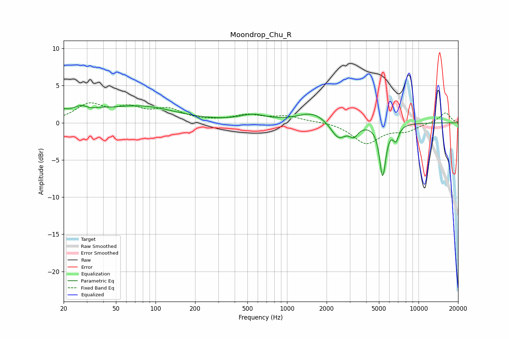

# Moondrop_Chu_R
See [usage instructions](https://github.com/jaakkopasanen/AutoEq#usage) for more options and info.

### Parametric EQs
Apply preamp of -2.4 dB when using parametric equalizer.

|   # | Type    |   Fc (Hz) |    Q |   Gain (dB) |
|-----|---------|-----------|------|-------------|
|   1 | Peaking |        20 | 5.83 |         0.6 |
|   2 | Peaking |        29 | 1.47 |         2   |
|   3 | Peaking |        32 | 2.92 |        -0.8 |
|   4 | Peaking |        77 | 0.53 |         2.1 |
|   5 | Peaking |       550 | 1.42 |         0.9 |
|   6 | Peaking |      1565 | 1.28 |         1.4 |
|   7 | Peaking |      2458 | 2.49 |        -2.3 |
|   8 | Peaking |      3222 | 4.26 |        -1.3 |
|   9 | Peaking |      5336 | 5.84 |        -6.9 |
|  10 | Peaking |      6734 | 6    |        -1.9 |

### Fixed Band EQs
When using fixed band (also called graphic) equalizer, apply preamp of **-2.8 dB** (if available) and set gains manually with these parameters.

|   # | Type    |   Fc (Hz) |    Q |   Gain (dB) |
|-----|---------|-----------|------|-------------|
|   1 | Peaking |        31 | 1.41 |         2.3 |
|   2 | Peaking |        62 | 1.41 |         1.7 |
|   3 | Peaking |       125 | 1.41 |         1.6 |
|   4 | Peaking |       250 | 1.41 |         0.1 |
|   5 | Peaking |       500 | 1.41 |         0.9 |
|   6 | Peaking |      1000 | 1.41 |         0.8 |
|   7 | Peaking |      2000 | 1.41 |         0.2 |
|   8 | Peaking |      4000 | 1.41 |        -2.7 |
|   9 | Peaking |      8000 | 1.41 |        -1   |
|  10 | Peaking |     16000 | 1.41 |         1.4 |

### Graphs

