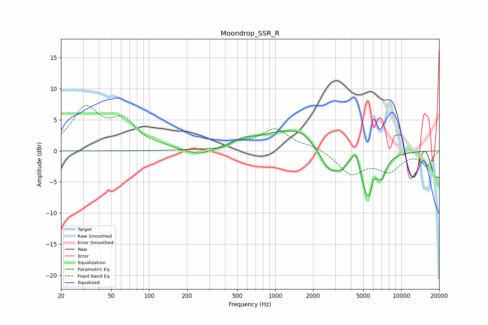

# Moondrop_SSR_R
See [usage instructions](https://github.com/jaakkopasanen/AutoEq#usage) for more options and info.

### Parametric EQs
Apply preamp of -3.3 dB when using parametric equalizer.

|   # | Type    |   Fc (Hz) |    Q |   Gain (dB) |
|-----|---------|-----------|------|-------------|
|   1 | Peaking |       391 | 1.86 |        -0.6 |
|   2 | Peaking |       528 | 1.44 |         1.1 |
|   3 | Peaking |      1294 | 0.64 |         3.3 |
|   4 | Peaking |      1636 | 2.33 |         0.6 |
|   5 | Peaking |      2710 | 1.87 |        -4   |
|   6 | Peaking |      3338 | 4.41 |        -1.1 |
|   7 | Peaking |      4385 | 4.38 |         3   |
|   8 | Peaking |      5510 | 2.33 |        -8.4 |
|   9 | Peaking |      6016 | 6    |         2.2 |
|  10 | Peaking |      7074 | 4.5  |        -2   |

### Fixed Band EQs
When using fixed band (also called graphic) equalizer, apply preamp of **-7.4 dB** (if available) and set gains manually with these parameters.

|   # | Type    |   Fc (Hz) |    Q |   Gain (dB) |
|-----|---------|-----------|------|-------------|
|   1 | Peaking |        31 | 1.41 |         6.5 |
|   2 | Peaking |        62 | 1.41 |         4.3 |
|   3 | Peaking |       125 | 1.41 |         0.4 |
|   4 | Peaking |       250 | 1.41 |        -1   |
|   5 | Peaking |       500 | 1.41 |         1.2 |
|   6 | Peaking |      1000 | 1.41 |         3.4 |
|   7 | Peaking |      2000 | 1.41 |         0.8 |
|   8 | Peaking |      4000 | 1.41 |        -3.6 |
|   9 | Peaking |      8000 | 1.41 |        -3   |
|  10 | Peaking |     16000 | 1.41 |        -2.3 |

### Graphs

