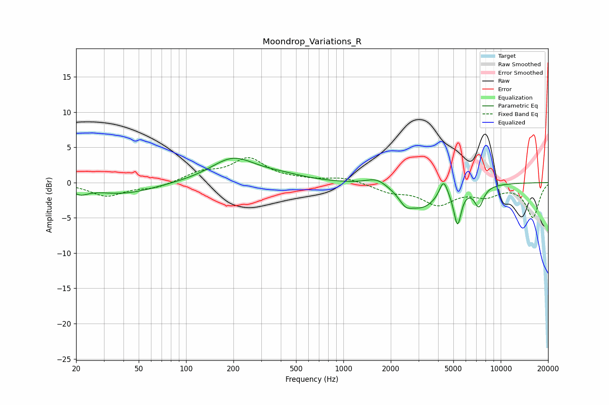

# Moondrop_Variations_R
See [usage instructions](https://github.com/jaakkopasanen/AutoEq#usage) for more options and info.

### Parametric EQs
Apply preamp of -3.5 dB when using parametric equalizer.

|   # | Type    |   Fc (Hz) |    Q |   Gain (dB) |
|-----|---------|-----------|------|-------------|
|   1 | Peaking |        21 | 2.91 |        -1   |
|   2 | Peaking |        40 | 0.71 |        -1.6 |
|   3 | Peaking |       199 | 0.99 |         3.4 |
|   4 | Peaking |       405 | 0.96 |         0.7 |
|   5 | Peaking |      1636 | 2.04 |         1.2 |
|   6 | Peaking |      2480 | 3.9  |        -1.2 |
|   7 | Peaking |      3113 | 1.24 |        -3.5 |
|   8 | Peaking |      4327 | 5.33 |         2.5 |
|   9 | Peaking |      5313 | 5.94 |        -5   |
|  10 | Peaking |      7270 | 4.58 |        -2.8 |

### Fixed Band EQs
When using fixed band (also called graphic) equalizer, apply preamp of **-3.6 dB** (if available) and set gains manually with these parameters.

|   # | Type    |   Fc (Hz) |    Q |   Gain (dB) |
|-----|---------|-----------|------|-------------|
|   1 | Peaking |        31 | 1.41 |        -1.9 |
|   2 | Peaking |        62 | 1.41 |        -0.8 |
|   3 | Peaking |       125 | 1.41 |         1.3 |
|   4 | Peaking |       250 | 1.41 |         3.3 |
|   5 | Peaking |       500 | 1.41 |         0.3 |
|   6 | Peaking |      1000 | 1.41 |         0.7 |
|   7 | Peaking |      2000 | 1.41 |        -1.2 |
|   8 | Peaking |      4000 | 1.41 |        -2.9 |
|   9 | Peaking |      8000 | 1.41 |        -1.6 |
|  10 | Peaking |     16000 | 1.41 |        -4.8 |

### Graphs

