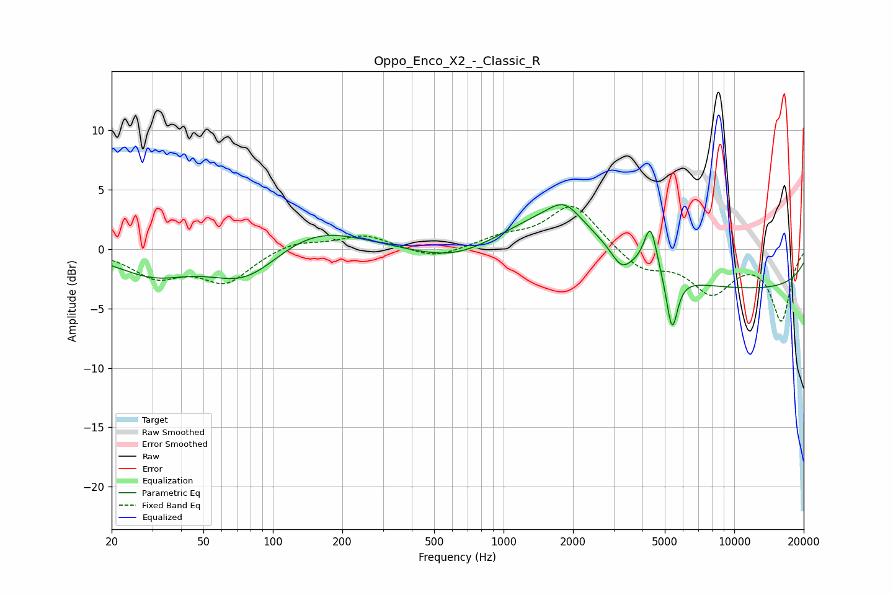

# Oppo_Enco_X2_-_Classic_R
See [usage instructions](https://github.com/jaakkopasanen/AutoEq#usage) for more options and info.

### Parametric EQs
Apply preamp of -3.8 dB when using parametric equalizer.

|   # | Type    |   Fc (Hz) |    Q |   Gain (dB) |
|-----|---------|-----------|------|-------------|
|   1 | Peaking |        30 | 0.91 |        -2   |
|   2 | Peaking |        77 | 0.91 |        -3   |
|   3 | Peaking |       148 | 0.68 |         2.2 |
|   4 | Peaking |       623 | 0.78 |        -1.5 |
|   5 | Peaking |      1715 | 0.61 |         4   |
|   6 | Peaking |      1837 | 2.14 |         1.6 |
|   7 | Peaking |      3240 | 3.24 |        -1.5 |
|   8 | Peaking |      4334 | 5.01 |         3.8 |
|   9 | Peaking |      5375 | 5.77 |        -4.7 |
|  10 | Peaking |     10000 | 0.18 |        -3.4 |

### Fixed Band EQs
When using fixed band (also called graphic) equalizer, apply preamp of **-3.7 dB** (if available) and set gains manually with these parameters.

|   # | Type    |   Fc (Hz) |    Q |   Gain (dB) |
|-----|---------|-----------|------|-------------|
|   1 | Peaking |        31 | 1.41 |        -2.2 |
|   2 | Peaking |        62 | 1.41 |        -2.7 |
|   3 | Peaking |       125 | 1.41 |         0.7 |
|   4 | Peaking |       250 | 1.41 |         1.2 |
|   5 | Peaking |       500 | 1.41 |        -0.9 |
|   6 | Peaking |      1000 | 1.41 |         0.9 |
|   7 | Peaking |      2000 | 1.41 |         3.8 |
|   8 | Peaking |      4000 | 1.41 |        -1.7 |
|   9 | Peaking |      8000 | 1.41 |        -3.5 |
|  10 | Peaking |     16000 | 1.41 |        -5.9 |

### Graphs

