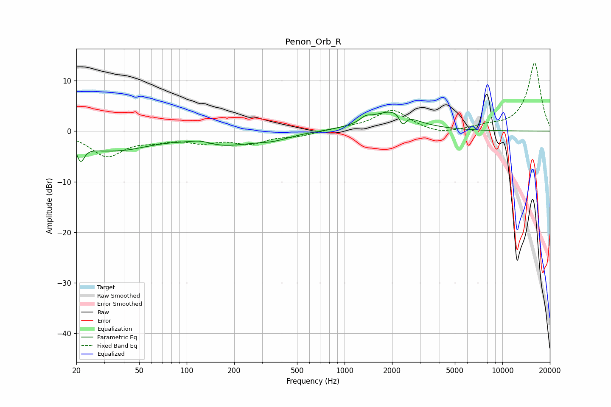

# Penon_Orb_R
See [usage instructions](https://github.com/jaakkopasanen/AutoEq#usage) for more options and info.

### Parametric EQs
Apply preamp of -3.9 dB when using parametric equalizer.

|   # | Type    |   Fc (Hz) |    Q |   Gain (dB) |
|-----|---------|-----------|------|-------------|
|   1 | Peaking |        21 | 5.87 |        -3.5 |
|   2 | Peaking |        27 | 1.47 |        -0.9 |
|   3 | Peaking |        38 | 0.71 |        -3.1 |
|   4 | Peaking |       123 | 2.07 |         0.8 |
|   5 | Peaking |       168 | 0.73 |        -2.5 |
|   6 | Peaking |       352 | 1.29 |        -1.1 |
|   7 | Peaking |      1359 | 4.38 |         0.9 |
|   8 | Peaking |      1948 | 1.05 |         3.7 |
|   9 | Peaking |      2310 | 3.74 |         1.8 |
|  10 | Peaking |      2331 | 5.77 |        -3.5 |

### Fixed Band EQs
When using fixed band (also called graphic) equalizer, apply preamp of **-13.6 dB** (if available) and set gains manually with these parameters.

|   # | Type    |   Fc (Hz) |    Q |   Gain (dB) |
|-----|---------|-----------|------|-------------|
|   1 | Peaking |        31 | 1.41 |        -4.8 |
|   2 | Peaking |        62 | 1.41 |        -1.3 |
|   3 | Peaking |       125 | 1.41 |        -1.8 |
|   4 | Peaking |       250 | 1.41 |        -2.2 |
|   5 | Peaking |       500 | 1.41 |        -0.9 |
|   6 | Peaking |      1000 | 1.41 |         0.5 |
|   7 | Peaking |      2000 | 1.41 |         4.1 |
|   8 | Peaking |      4000 | 1.41 |        -0.8 |
|   9 | Peaking |      8000 | 1.41 |         0.7 |
|  10 | Peaking |     16000 | 1.41 |        13.6 |

### Graphs

