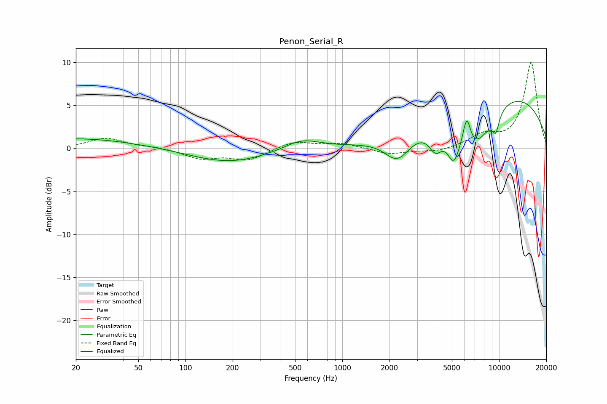

# Penon_Serial_R
See [usage instructions](https://github.com/jaakkopasanen/AutoEq#usage) for more options and info.

### Parametric EQs
Apply preamp of -5.6 dB when using parametric equalizer.

|   # | Type    |   Fc (Hz) |    Q |   Gain (dB) |
|-----|---------|-----------|------|-------------|
|   1 | Peaking |        20 | 0.35 |         1.2 |
|   2 | Peaking |       190 | 0.58 |        -1.6 |
|   3 | Peaking |       551 | 1.25 |         1.2 |
|   4 | Peaking |      2251 | 1.74 |        -3   |
|   5 | Peaking |      3937 | 3.26 |        -2.4 |
|   6 | Peaking |      5129 | 3.38 |        -3.6 |
|   7 | Peaking |      6218 | 5.73 |         3.3 |
|   8 | Peaking |      7049 | 1.22 |        -5.2 |
|   9 | Peaking |      9519 | 5.41 |        -2.1 |
|  10 | Peaking |     10000 | 0.27 |         6.7 |

### Fixed Band EQs
When using fixed band (also called graphic) equalizer, apply preamp of **-10.1 dB** (if available) and set gains manually with these parameters.

|   # | Type    |   Fc (Hz) |    Q |   Gain (dB) |
|-----|---------|-----------|------|-------------|
|   1 | Peaking |        31 | 1.41 |         1.2 |
|   2 | Peaking |        62 | 1.41 |         0.2 |
|   3 | Peaking |       125 | 1.41 |        -1.1 |
|   4 | Peaking |       250 | 1.41 |        -1.3 |
|   5 | Peaking |       500 | 1.41 |         0.9 |
|   6 | Peaking |      1000 | 1.41 |         0.6 |
|   7 | Peaking |      2000 | 1.41 |        -0.7 |
|   8 | Peaking |      4000 | 1.41 |        -0.4 |
|   9 | Peaking |      8000 | 1.41 |         1.4 |
|  10 | Peaking |     16000 | 1.41 |        10   |

### Graphs

