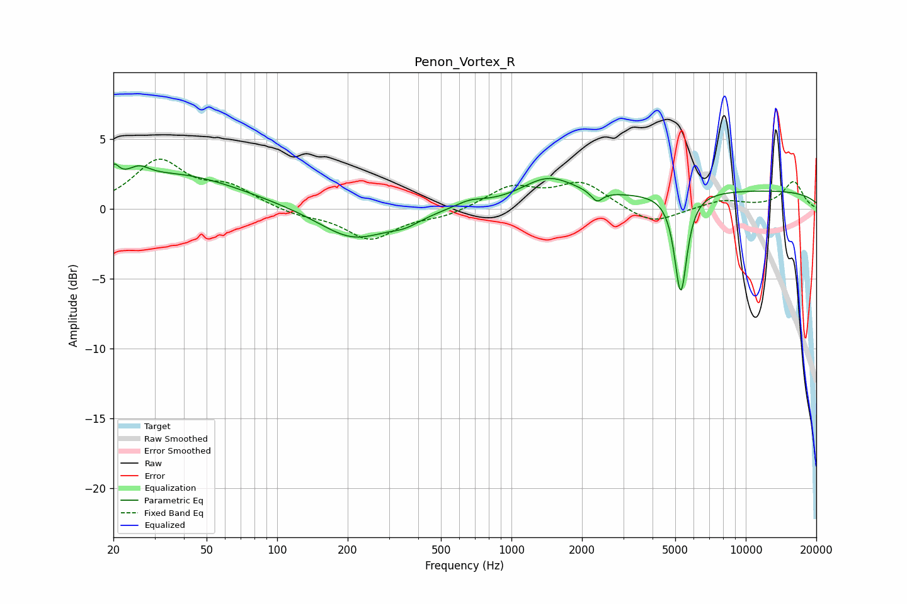

# Penon_Vortex_R
See [usage instructions](https://github.com/jaakkopasanen/AutoEq#usage) for more options and info.

### Parametric EQs
Apply preamp of -3.3 dB when using parametric equalizer.

|   # | Type    |   Fc (Hz) |    Q |   Gain (dB) |
|-----|---------|-----------|------|-------------|
|   1 | Peaking |        20 | 5.91 |         1.3 |
|   2 | Peaking |        26 | 3.03 |         0.9 |
|   3 | Peaking |        37 | 0.51 |         2.4 |
|   4 | Peaking |       211 | 0.97 |        -2.2 |
|   5 | Peaking |       351 | 2.09 |        -0.6 |
|   6 | Peaking |       662 | 2.19 |         0.5 |
|   7 | Peaking |      1428 | 1.23 |         1.9 |
|   8 | Peaking |      2316 | 5.94 |        -0.8 |
|   9 | Peaking |      5280 | 5.28 |        -7.2 |
|  10 | Peaking |     10000 | 0.19 |         1.3 |

### Fixed Band EQs
When using fixed band (also called graphic) equalizer, apply preamp of **-3.7 dB** (if available) and set gains manually with these parameters.

|   # | Type    |   Fc (Hz) |    Q |   Gain (dB) |
|-----|---------|-----------|------|-------------|
|   1 | Peaking |        31 | 1.41 |         3.3 |
|   2 | Peaking |        62 | 1.41 |         1.4 |
|   3 | Peaking |       125 | 1.41 |        -0.4 |
|   4 | Peaking |       250 | 1.41 |        -2.1 |
|   5 | Peaking |       500 | 1.41 |        -0.5 |
|   6 | Peaking |      1000 | 1.41 |         1.5 |
|   7 | Peaking |      2000 | 1.41 |         1.8 |
|   8 | Peaking |      4000 | 1.41 |        -1.2 |
|   9 | Peaking |      8000 | 1.41 |         0.6 |
|  10 | Peaking |     16000 | 1.41 |         1.9 |

### Graphs

