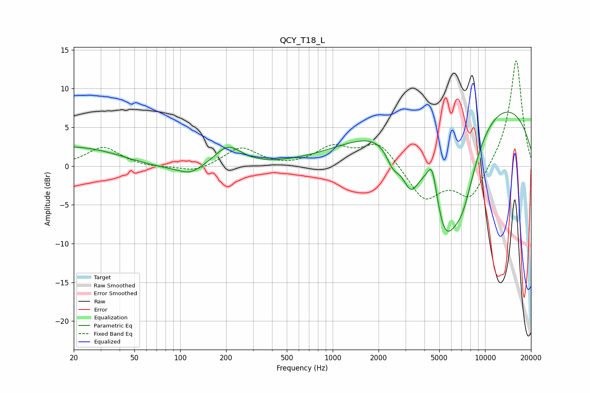

# QCY_T18_L
See [usage instructions](https://github.com/jaakkopasanen/AutoEq#usage) for more options and info.

### Parametric EQs
Apply preamp of -7.1 dB when using parametric equalizer.

|   # | Type    |   Fc (Hz) |    Q |   Gain (dB) |
|-----|---------|-----------|------|-------------|
|   1 | Peaking |        21 | 0.37 |         4.6 |
|   2 | Peaking |        34 | 0.24 |        -2.3 |
|   3 | Peaking |       116 | 2.06 |        -0.9 |
|   4 | Peaking |       205 | 1.57 |         2.8 |
|   5 | Peaking |      2494 | 2.92 |        -2.8 |
|   6 | Peaking |      3249 | 2.34 |        -5.6 |
|   7 | Peaking |      4493 | 4.61 |         3.9 |
|   8 | Peaking |      5423 | 1.38 |       -12.5 |
|   9 | Peaking |      7082 | 1.34 |        -8.7 |
|  10 | Peaking |      7904 | 0.19 |         9.9 |

### Fixed Band EQs
When using fixed band (also called graphic) equalizer, apply preamp of **-13.7 dB** (if available) and set gains manually with these parameters.

|   # | Type    |   Fc (Hz) |    Q |   Gain (dB) |
|-----|---------|-----------|------|-------------|
|   1 | Peaking |        31 | 1.41 |         2.5 |
|   2 | Peaking |        62 | 1.41 |        -0.2 |
|   3 | Peaking |       125 | 1.41 |        -0.8 |
|   4 | Peaking |       250 | 1.41 |         2.4 |
|   5 | Peaking |       500 | 1.41 |        -0.2 |
|   6 | Peaking |      1000 | 1.41 |         2.3 |
|   7 | Peaking |      2000 | 1.41 |         3.1 |
|   8 | Peaking |      4000 | 1.41 |        -4.4 |
|   9 | Peaking |      8000 | 1.41 |        -4.3 |
|  10 | Peaking |     16000 | 1.41 |        14   |

### Graphs

