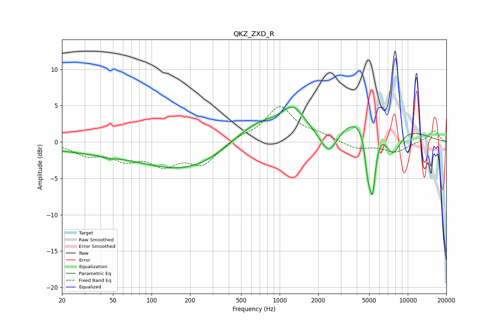

# QKZ_ZXD_R
See [usage instructions](https://github.com/jaakkopasanen/AutoEq#usage) for more options and info.

### Parametric EQs
Apply preamp of -4.9 dB when using parametric equalizer.

|   # | Type    |   Fc (Hz) |    Q |   Gain (dB) |
|-----|---------|-----------|------|-------------|
|   1 | Peaking |        39 | 0.31 |        -1.3 |
|   2 | Peaking |        46 | 4.57 |        -0.3 |
|   3 | Peaking |       198 | 0.45 |        -3.5 |
|   4 | Peaking |       659 | 0.72 |         3   |
|   5 | Peaking |      1266 | 1.68 |         3   |
|   6 | Peaking |      2423 | 1.78 |        -4.6 |
|   7 | Peaking |      4757 | 0.42 |         4.5 |
|   8 | Peaking |      4867 | 5.88 |        -4.5 |
|   9 | Peaking |      5303 | 5.42 |        -8.2 |
|  10 | Peaking |      7633 | 1.97 |        -4.5 |

### Fixed Band EQs
When using fixed band (also called graphic) equalizer, apply preamp of **-4.9 dB** (if available) and set gains manually with these parameters.

|   # | Type    |   Fc (Hz) |    Q |   Gain (dB) |
|-----|---------|-----------|------|-------------|
|   1 | Peaking |        31 | 1.41 |        -1.6 |
|   2 | Peaking |        62 | 1.41 |        -2.1 |
|   3 | Peaking |       125 | 1.41 |        -2.7 |
|   4 | Peaking |       250 | 1.41 |        -2.9 |
|   5 | Peaking |       500 | 1.41 |         0.7 |
|   6 | Peaking |      1000 | 1.41 |         4.7 |
|   7 | Peaking |      2000 | 1.41 |         0.8 |
|   8 | Peaking |      4000 | 1.41 |        -0.9 |
|   9 | Peaking |      8000 | 1.41 |        -1.4 |
|  10 | Peaking |     16000 | 1.41 |         1.6 |

### Graphs

