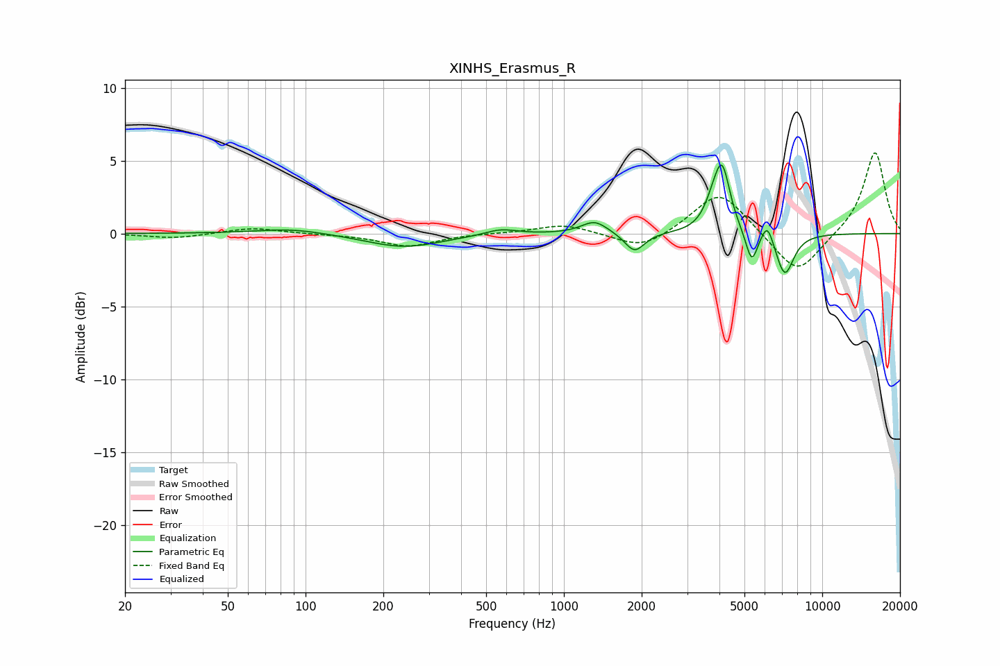

# XINHS_Erasmus_R
See [usage instructions](https://github.com/jaakkopasanen/AutoEq#usage) for more options and info.

### Parametric EQs
Apply preamp of -4.8 dB when using parametric equalizer.

|   # | Type    |   Fc (Hz) |    Q |   Gain (dB) |
|-----|---------|-----------|------|-------------|
|   1 | Peaking |        88 | 1.05 |         0.4 |
|   2 | Peaking |       240 | 0.97 |        -0.9 |
|   3 | Peaking |       570 | 2.27 |         0.4 |
|   4 | Peaking |      1315 | 2.82 |         0.9 |
|   5 | Peaking |      1878 | 3.75 |        -1.3 |
|   6 | Peaking |      3767 | 4.23 |         1.2 |
|   7 | Peaking |      4099 | 4.61 |         4.2 |
|   8 | Peaking |      5333 | 6    |        -2.2 |
|   9 | Peaking |      6131 | 6    |         1.4 |
|  10 | Peaking |      7161 | 3.89 |        -2.9 |

### Fixed Band EQs
When using fixed band (also called graphic) equalizer, apply preamp of **-5.6 dB** (if available) and set gains manually with these parameters.

|   # | Type    |   Fc (Hz) |    Q |   Gain (dB) |
|-----|---------|-----------|------|-------------|
|   1 | Peaking |        31 | 1.41 |        -0.3 |
|   2 | Peaking |        62 | 1.41 |         0.4 |
|   3 | Peaking |       125 | 1.41 |        -0   |
|   4 | Peaking |       250 | 1.41 |        -0.9 |
|   5 | Peaking |       500 | 1.41 |         0   |
|   6 | Peaking |      1000 | 1.41 |         0.6 |
|   7 | Peaking |      2000 | 1.41 |        -1.2 |
|   8 | Peaking |      4000 | 1.41 |         3   |
|   9 | Peaking |      8000 | 1.41 |        -2.9 |
|  10 | Peaking |     16000 | 1.41 |         5.7 |

### Graphs

