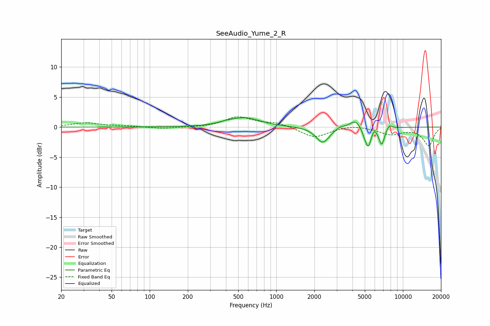

# SeeAudio_Yume_2_R
See [usage instructions](https://github.com/jaakkopasanen/AutoEq#usage) for more options and info.

### Parametric EQs
Apply preamp of -1.7 dB when using parametric equalizer.

|   # | Type    |   Fc (Hz) |    Q |   Gain (dB) |
|-----|---------|-----------|------|-------------|
|   1 | Peaking |       402 | 2.36 |         0.2 |
|   2 | Peaking |       564 | 1.16 |         1.5 |
|   3 | Peaking |      2325 | 2.73 |        -2.6 |
|   4 | Peaking |      3206 | 4.73 |         0.4 |
|   5 | Peaking |      4220 | 3.17 |         1.4 |
|   6 | Peaking |      4996 | 5.99 |        -0.9 |
|   7 | Peaking |      5343 | 5.95 |        -3   |
|   8 | Peaking |      5916 | 6    |         0.8 |
|   9 | Peaking |      6799 | 5.93 |        -2.9 |
|  10 | Peaking |      7802 | 6    |         0.8 |

### Fixed Band EQs
When using fixed band (also called graphic) equalizer, apply preamp of **-1.8 dB** (if available) and set gains manually with these parameters.

|   # | Type    |   Fc (Hz) |    Q |   Gain (dB) |
|-----|---------|-----------|------|-------------|
|   1 | Peaking |        31 | 1.41 |         0.7 |
|   2 | Peaking |        62 | 1.41 |         0.2 |
|   3 | Peaking |       125 | 1.41 |        -0.3 |
|   4 | Peaking |       250 | 1.41 |        -0.1 |
|   5 | Peaking |       500 | 1.41 |         1.7 |
|   6 | Peaking |      1000 | 1.41 |         0.7 |
|   7 | Peaking |      2000 | 1.41 |        -1.8 |
|   8 | Peaking |      4000 | 1.41 |         0.4 |
|   9 | Peaking |      8000 | 1.41 |        -1.2 |
|  10 | Peaking |     16000 | 1.41 |        -3   |

### Graphs

