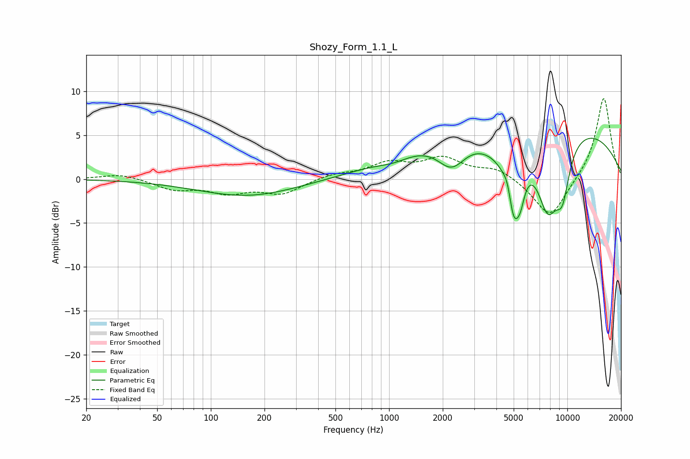

# Shozy_Form_1.1_L
See [usage instructions](https://github.com/jaakkopasanen/AutoEq#usage) for more options and info.

### Parametric EQs
Apply preamp of -4.7 dB when using parametric equalizer.

|   # | Type    |   Fc (Hz) |    Q |   Gain (dB) |
|-----|---------|-----------|------|-------------|
|   1 | Peaking |       161 | 0.5  |        -2   |
|   2 | Peaking |      1064 | 1.51 |        -0.7 |
|   3 | Peaking |      2243 | 1.75 |        -3.4 |
|   4 | Peaking |      4192 | 1.12 |        -1.9 |
|   5 | Peaking |      4638 | 5.99 |         1.7 |
|   6 | Peaking |      4999 | 3.48 |        -7.7 |
|   7 | Peaking |      5473 | 5.88 |        -2   |
|   8 | Peaking |      6214 | 0.18 |         7.2 |
|   9 | Peaking |      7763 | 2.02 |        -8.3 |
|  10 | Peaking |      9387 | 3.05 |        -5.2 |

### Fixed Band EQs
When using fixed band (also called graphic) equalizer, apply preamp of **-9.3 dB** (if available) and set gains manually with these parameters.

|   # | Type    |   Fc (Hz) |    Q |   Gain (dB) |
|-----|---------|-----------|------|-------------|
|   1 | Peaking |        31 | 1.41 |         0.6 |
|   2 | Peaking |        62 | 1.41 |        -1.1 |
|   3 | Peaking |       125 | 1.41 |        -1.4 |
|   4 | Peaking |       250 | 1.41 |        -1.6 |
|   5 | Peaking |       500 | 1.41 |         0.5 |
|   6 | Peaking |      1000 | 1.41 |         1.7 |
|   7 | Peaking |      2000 | 1.41 |         2.2 |
|   8 | Peaking |      4000 | 1.41 |         1.2 |
|   9 | Peaking |      8000 | 1.41 |        -4.6 |
|  10 | Peaking |     16000 | 1.41 |         9.4 |

### Graphs

