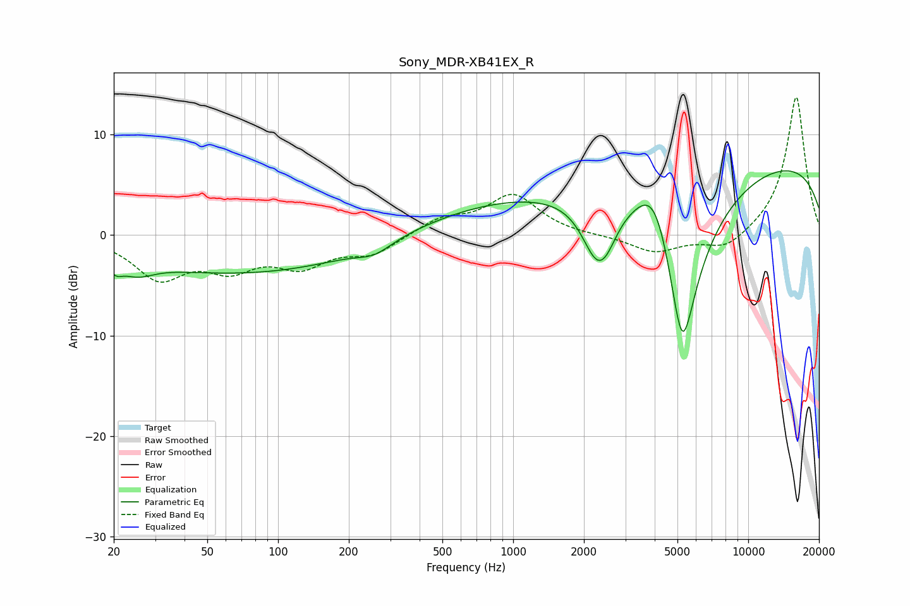

# Sony_MDR-XB41EX_R
See [usage instructions](https://github.com/jaakkopasanen/AutoEq#usage) for more options and info.

### Parametric EQs
Apply preamp of -6.5 dB when using parametric equalizer.

|   # | Type    |   Fc (Hz) |    Q |   Gain (dB) |
|-----|---------|-----------|------|-------------|
|   1 | Peaking |        20 | 5.19 |        -1   |
|   2 | Peaking |        25 | 1.99 |        -1.4 |
|   3 | Peaking |        72 | 0.26 |        -3.8 |
|   4 | Peaking |       257 | 1.97 |        -1   |
|   5 | Peaking |       888 | 0.38 |         2.9 |
|   6 | Peaking |      2260 | 2.2  |        -5.2 |
|   7 | Peaking |      2488 | 2.98 |        -1.7 |
|   8 | Peaking |      4023 | 1.69 |         6.5 |
|   9 | Peaking |      5238 | 1.57 |       -20   |
|  10 | Peaking |     10000 | 0.18 |         7.8 |

### Fixed Band EQs
When using fixed band (also called graphic) equalizer, apply preamp of **-13.8 dB** (if available) and set gains manually with these parameters.

|   # | Type    |   Fc (Hz) |    Q |   Gain (dB) |
|-----|---------|-----------|------|-------------|
|   1 | Peaking |        31 | 1.41 |        -4   |
|   2 | Peaking |        62 | 1.41 |        -2.8 |
|   3 | Peaking |       125 | 1.41 |        -2.7 |
|   4 | Peaking |       250 | 1.41 |        -1.8 |
|   5 | Peaking |       500 | 1.41 |         1.5 |
|   6 | Peaking |      1000 | 1.41 |         3.9 |
|   7 | Peaking |      2000 | 1.41 |        -0.1 |
|   8 | Peaking |      4000 | 1.41 |        -1.7 |
|   9 | Peaking |      8000 | 1.41 |        -1.6 |
|  10 | Peaking |     16000 | 1.41 |        13.9 |

### Graphs

