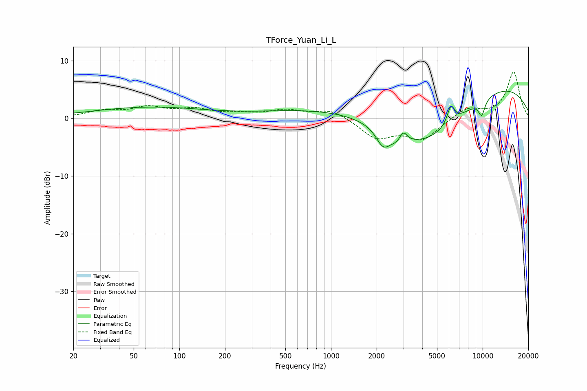

# TForce_Yuan_Li_L
See [usage instructions](https://github.com/jaakkopasanen/AutoEq#usage) for more options and info.

### Parametric EQs
Apply preamp of -4.8 dB when using parametric equalizer.

|   # | Type    |   Fc (Hz) |    Q |   Gain (dB) |
|-----|---------|-----------|------|-------------|
|   1 | Peaking |        63 | 0.37 |         1.9 |
|   2 | Peaking |       931 | 0.35 |         1.6 |
|   3 | Peaking |      2204 | 3.09 |        -2.9 |
|   4 | Peaking |      2750 | 2.43 |        -1.3 |
|   5 | Peaking |      3000 | 5.61 |         2   |
|   6 | Peaking |      4150 | 0.56 |        -6.4 |
|   7 | Peaking |      4703 | 0.4  |        -3.5 |
|   8 | Peaking |      6182 | 5.49 |         3.2 |
|   9 | Peaking |      8857 | 0.23 |         7.5 |
|  10 | Peaking |      9849 | 5.67 |        -2.7 |

### Fixed Band EQs
When using fixed band (also called graphic) equalizer, apply preamp of **-8.1 dB** (if available) and set gains manually with these parameters.

|   # | Type    |   Fc (Hz) |    Q |   Gain (dB) |
|-----|---------|-----------|------|-------------|
|   1 | Peaking |        31 | 1.41 |         1.1 |
|   2 | Peaking |        62 | 1.41 |         1.7 |
|   3 | Peaking |       125 | 1.41 |         1.4 |
|   4 | Peaking |       250 | 1.41 |         0.6 |
|   5 | Peaking |       500 | 1.41 |         1.3 |
|   6 | Peaking |      1000 | 1.41 |         1.6 |
|   7 | Peaking |      2000 | 1.41 |        -3.3 |
|   8 | Peaking |      4000 | 1.41 |        -3.5 |
|   9 | Peaking |      8000 | 1.41 |         1.8 |
|  10 | Peaking |     16000 | 1.41 |         8   |

### Graphs

