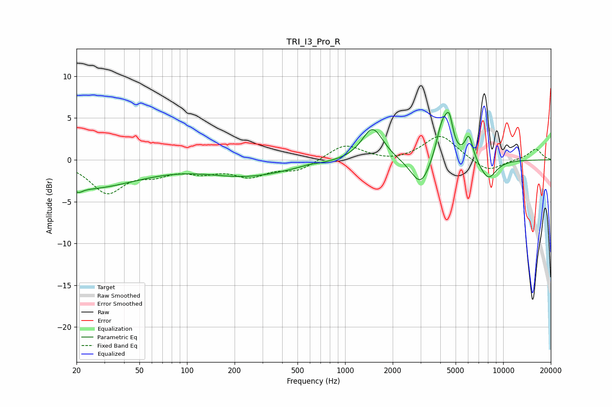

# TRI_I3_Pro_R
See [usage instructions](https://github.com/jaakkopasanen/AutoEq#usage) for more options and info.

### Parametric EQs
Apply preamp of -5.8 dB when using parametric equalizer.

|   # | Type    |   Fc (Hz) |    Q |   Gain (dB) |
|-----|---------|-----------|------|-------------|
|   1 | Peaking |        21 | 5.87 |        -0.5 |
|   2 | Peaking |        22 | 0.4  |        -3.4 |
|   3 | Peaking |       242 | 0.53 |        -1.8 |
|   4 | Peaking |       591 | 3.59 |         0.1 |
|   5 | Peaking |      1492 | 2.11 |         4   |
|   6 | Peaking |      3014 | 2.26 |        -3.4 |
|   7 | Peaking |      4125 | 3.52 |         4.5 |
|   8 | Peaking |      4564 | 5.97 |         3.2 |
|   9 | Peaking |      6069 | 5.23 |         3   |
|  10 | Peaking |      8034 | 2.5  |        -2.4 |

### Fixed Band EQs
When using fixed band (also called graphic) equalizer, apply preamp of **-2.9 dB** (if available) and set gains manually with these parameters.

|   # | Type    |   Fc (Hz) |    Q |   Gain (dB) |
|-----|---------|-----------|------|-------------|
|   1 | Peaking |        31 | 1.41 |        -3.8 |
|   2 | Peaking |        62 | 1.41 |        -1.3 |
|   3 | Peaking |       125 | 1.41 |        -1.2 |
|   4 | Peaking |       250 | 1.41 |        -1.7 |
|   5 | Peaking |       500 | 1.41 |        -1.2 |
|   6 | Peaking |      1000 | 1.41 |         1.9 |
|   7 | Peaking |      2000 | 1.41 |        -0.3 |
|   8 | Peaking |      4000 | 1.41 |         3   |
|   9 | Peaking |      8000 | 1.41 |        -1.5 |
|  10 | Peaking |     16000 | 1.41 |         1.3 |

### Graphs

