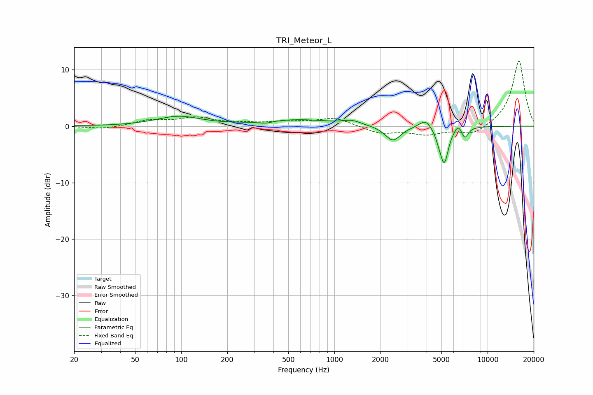

# TRI_Meteor_L
See [usage instructions](https://github.com/jaakkopasanen/AutoEq#usage) for more options and info.

### Parametric EQs
Apply preamp of -1.8 dB when using parametric equalizer.

|   # | Type    |   Fc (Hz) |    Q |   Gain (dB) |
|-----|---------|-----------|------|-------------|
|   1 | Peaking |        96 | 0.98 |         1.7 |
|   2 | Peaking |       354 | 3.19 |        -0.4 |
|   3 | Peaking |       577 | 0.62 |         1.1 |
|   4 | Peaking |      1302 | 2.53 |         0.7 |
|   5 | Peaking |      2407 | 2.78 |        -2.7 |
|   6 | Peaking |      3935 | 3.44 |         1.6 |
|   7 | Peaking |      4819 | 6    |        -1   |
|   8 | Peaking |      5217 | 5.15 |        -6.2 |
|   9 | Peaking |      6421 | 5.98 |         1.3 |
|  10 | Peaking |      7105 | 6    |        -1.9 |

### Fixed Band EQs
When using fixed band (also called graphic) equalizer, apply preamp of **-11.6 dB** (if available) and set gains manually with these parameters.

|   # | Type    |   Fc (Hz) |    Q |   Gain (dB) |
|-----|---------|-----------|------|-------------|
|   1 | Peaking |        31 | 1.41 |        -0.5 |
|   2 | Peaking |        62 | 1.41 |         1   |
|   3 | Peaking |       125 | 1.41 |         1.4 |
|   4 | Peaking |       250 | 1.41 |         0.4 |
|   5 | Peaking |       500 | 1.41 |         0.7 |
|   6 | Peaking |      1000 | 1.41 |         1.5 |
|   7 | Peaking |      2000 | 1.41 |        -1.3 |
|   8 | Peaking |      4000 | 1.41 |        -1.4 |
|   9 | Peaking |      8000 | 1.41 |        -1.6 |
|  10 | Peaking |     16000 | 1.41 |        11.7 |

### Graphs

