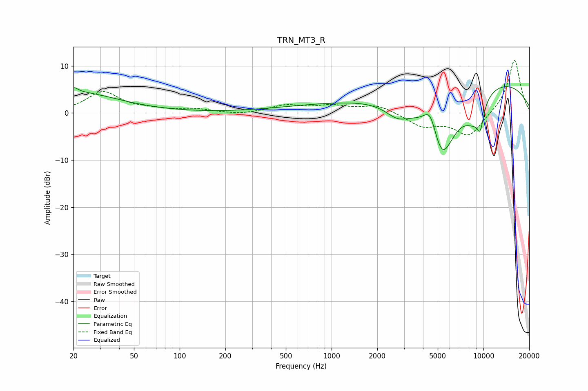

# TRN_MT3_R
See [usage instructions](https://github.com/jaakkopasanen/AutoEq#usage) for more options and info.

### Parametric EQs
Apply preamp of -5.7 dB when using parametric equalizer.

|   # | Type    |   Fc (Hz) |    Q |   Gain (dB) |
|-----|---------|-----------|------|-------------|
|   1 | Peaking |        20 | 0.49 |         4.4 |
|   2 | Peaking |        20 | 5.71 |         1   |
|   3 | Peaking |      1421 | 0.31 |         2   |
|   4 | Peaking |      1438 | 0.57 |         0   |
|   5 | Peaking |      2724 | 1.71 |        -2.8 |
|   6 | Peaking |      4465 | 3.12 |         5.5 |
|   7 | Peaking |      5324 | 1.27 |       -16.3 |
|   8 | Peaking |      8549 | 2.05 |        -4.1 |
|   9 | Peaking |      9520 | 5.29 |        -4.9 |
|  10 | Peaking |      9751 | 0.26 |         7.9 |

### Fixed Band EQs
When using fixed band (also called graphic) equalizer, apply preamp of **-11.2 dB** (if available) and set gains manually with these parameters.

|   # | Type    |   Fc (Hz) |    Q |   Gain (dB) |
|-----|---------|-----------|------|-------------|
|   1 | Peaking |        31 | 1.41 |         4.4 |
|   2 | Peaking |        62 | 1.41 |         0.6 |
|   3 | Peaking |       125 | 1.41 |         0.7 |
|   4 | Peaking |       250 | 1.41 |        -0.4 |
|   5 | Peaking |       500 | 1.41 |         1.5 |
|   6 | Peaking |      1000 | 1.41 |         1.3 |
|   7 | Peaking |      2000 | 1.41 |         1.7 |
|   8 | Peaking |      4000 | 1.41 |        -2.7 |
|   9 | Peaking |      8000 | 1.41 |        -5   |
|  10 | Peaking |     16000 | 1.41 |        11.5 |

### Graphs

