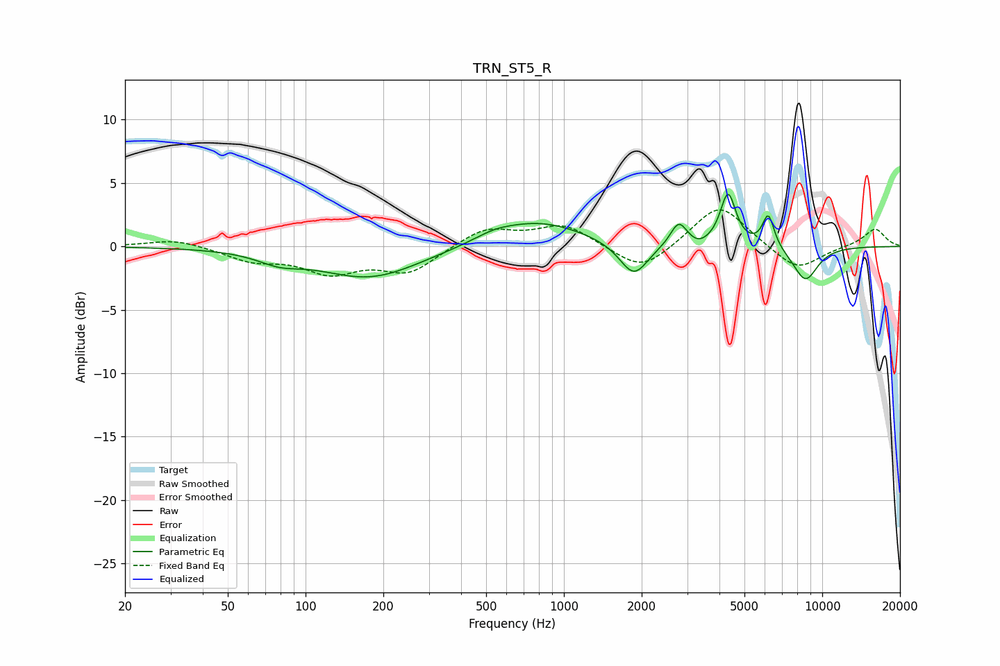

# TRN_ST5_R
See [usage instructions](https://github.com/jaakkopasanen/AutoEq#usage) for more options and info.

### Parametric EQs
Apply preamp of -4.2 dB when using parametric equalizer.

|   # | Type    |   Fc (Hz) |    Q |   Gain (dB) |
|-----|---------|-----------|------|-------------|
|   1 | Peaking |        79 | 1.73 |        -0.8 |
|   2 | Peaking |       177 | 0.72 |        -2.5 |
|   3 | Peaking |       536 | 1.87 |         0.4 |
|   4 | Peaking |       791 | 0.78 |         2   |
|   5 | Peaking |      1865 | 2.57 |        -2.7 |
|   6 | Peaking |      2784 | 4.38 |         1.9 |
|   7 | Peaking |      3314 | 4.03 |        -0.4 |
|   8 | Peaking |      4319 | 4.71 |         4.1 |
|   9 | Peaking |      6186 | 6    |         2.6 |
|  10 | Peaking |      8606 | 2.63 |        -2.7 |

### Fixed Band EQs
When using fixed band (also called graphic) equalizer, apply preamp of **-3.0 dB** (if available) and set gains manually with these parameters.

|   # | Type    |   Fc (Hz) |    Q |   Gain (dB) |
|-----|---------|-----------|------|-------------|
|   1 | Peaking |        31 | 1.41 |         0.6 |
|   2 | Peaking |        62 | 1.41 |        -1   |
|   3 | Peaking |       125 | 1.41 |        -1.9 |
|   4 | Peaking |       250 | 1.41 |        -2   |
|   5 | Peaking |       500 | 1.41 |         1.5 |
|   6 | Peaking |      1000 | 1.41 |         1.7 |
|   7 | Peaking |      2000 | 1.41 |        -2.1 |
|   8 | Peaking |      4000 | 1.41 |         3.5 |
|   9 | Peaking |      8000 | 1.41 |        -2   |
|  10 | Peaking |     16000 | 1.41 |         1.4 |

### Graphs

