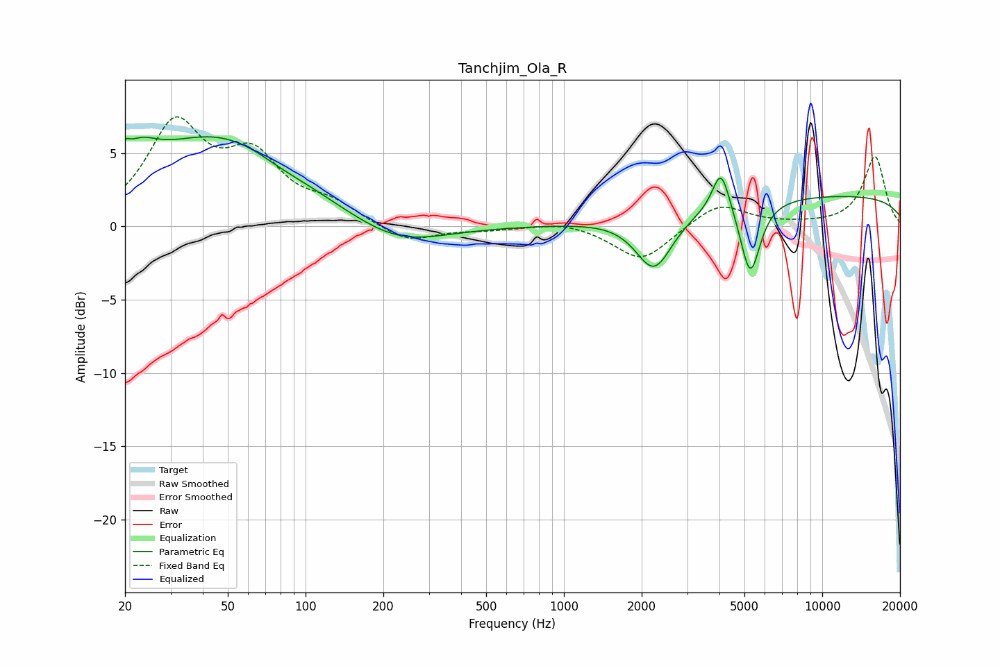

# Tanchjim_Ola_R
See [usage instructions](https://github.com/jaakkopasanen/AutoEq#usage) for more options and info.

### Parametric EQs
Apply preamp of -6.2 dB when using parametric equalizer.

|   # | Type    |   Fc (Hz) |    Q |   Gain (dB) |
|-----|---------|-----------|------|-------------|
|   1 | Peaking |        20 | 5.58 |         3.4 |
|   2 | Peaking |        20 | 5.41 |        -2.5 |
|   3 | Peaking |        22 | 1.91 |         2   |
|   4 | Peaking |        46 | 0.48 |         6   |
|   5 | Peaking |        79 | 1.92 |        -0.2 |
|   6 | Peaking |       227 | 0.79 |        -1.6 |
|   7 | Peaking |      2235 | 1.99 |        -3.8 |
|   8 | Peaking |      4057 | 4.17 |         3   |
|   9 | Peaking |      5267 | 3.61 |        -5   |
|  10 | Peaking |     10000 | 0.18 |         2.1 |

### Fixed Band EQs
When using fixed band (also called graphic) equalizer, apply preamp of **-7.6 dB** (if available) and set gains manually with these parameters.

|   # | Type    |   Fc (Hz) |    Q |   Gain (dB) |
|-----|---------|-----------|------|-------------|
|   1 | Peaking |        31 | 1.41 |         6.6 |
|   2 | Peaking |        62 | 1.41 |         4.2 |
|   3 | Peaking |       125 | 1.41 |         1.3 |
|   4 | Peaking |       250 | 1.41 |        -1.2 |
|   5 | Peaking |       500 | 1.41 |        -0.2 |
|   6 | Peaking |      1000 | 1.41 |         0.4 |
|   7 | Peaking |      2000 | 1.41 |        -2.4 |
|   8 | Peaking |      4000 | 1.41 |         1.6 |
|   9 | Peaking |      8000 | 1.41 |         0.1 |
|  10 | Peaking |     16000 | 1.41 |         4.8 |

### Graphs

