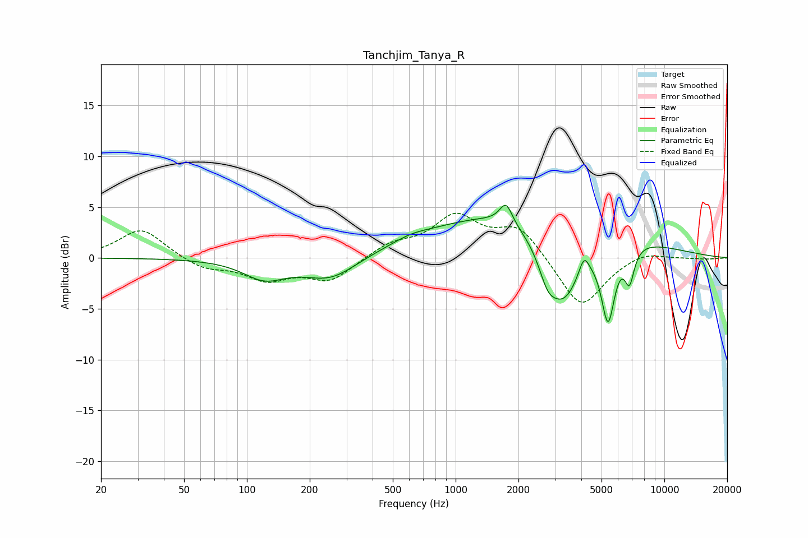

# Tanchjim_Tanya_R
See [usage instructions](https://github.com/jaakkopasanen/AutoEq#usage) for more options and info.

### Parametric EQs
Apply preamp of -5.3 dB when using parametric equalizer.

|   # | Type    |   Fc (Hz) |    Q |   Gain (dB) |
|-----|---------|-----------|------|-------------|
|   1 | Peaking |       121 | 1.39 |        -1.9 |
|   2 | Peaking |       252 | 1.1  |        -2.2 |
|   3 | Peaking |       608 | 1.67 |         0.4 |
|   4 | Peaking |      1745 | 4.71 |         2   |
|   5 | Peaking |      2307 | 0.3  |         5.1 |
|   6 | Peaking |      2750 | 3.48 |        -2.2 |
|   7 | Peaking |      3275 | 1.49 |        -7.8 |
|   8 | Peaking |      4120 | 6    |         1.8 |
|   9 | Peaking |      5374 | 4.2  |        -7.6 |
|  10 | Peaking |      6804 | 5.87 |        -3.3 |

### Fixed Band EQs
When using fixed band (also called graphic) equalizer, apply preamp of **-4.5 dB** (if available) and set gains manually with these parameters.

|   # | Type    |   Fc (Hz) |    Q |   Gain (dB) |
|-----|---------|-----------|------|-------------|
|   1 | Peaking |        31 | 1.41 |         2.9 |
|   2 | Peaking |        62 | 1.41 |        -1.1 |
|   3 | Peaking |       125 | 1.41 |        -2   |
|   4 | Peaking |       250 | 1.41 |        -2.2 |
|   5 | Peaking |       500 | 1.41 |         1.3 |
|   6 | Peaking |      1000 | 1.41 |         3.9 |
|   7 | Peaking |      2000 | 1.41 |         3   |
|   8 | Peaking |      4000 | 1.41 |        -5.1 |
|   9 | Peaking |      8000 | 1.41 |         0.7 |
|  10 | Peaking |     16000 | 1.41 |        -0.1 |

### Graphs

