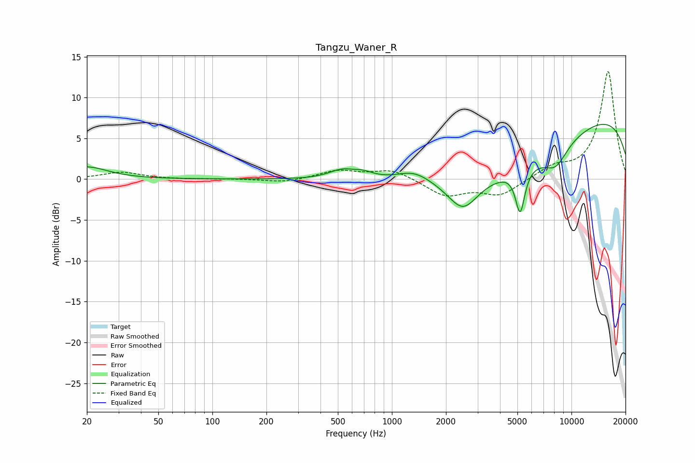

# Tangzu_Waner_R
See [usage instructions](https://github.com/jaakkopasanen/AutoEq#usage) for more options and info.

### Parametric EQs
Apply preamp of -6.8 dB when using parametric equalizer.

|   # | Type    |   Fc (Hz) |    Q |   Gain (dB) |
|-----|---------|-----------|------|-------------|
|   1 | Peaking |        20 | 1.25 |         1.5 |
|   2 | Peaking |       525 | 1.92 |         1.1 |
|   3 | Peaking |       693 | 2.31 |         0.7 |
|   4 | Peaking |      1118 | 2.17 |        -0   |
|   5 | Peaking |      1330 | 1.36 |         1.7 |
|   6 | Peaking |      2490 | 1.78 |        -3.4 |
|   7 | Peaking |      4073 | 0.34 |        -6.1 |
|   8 | Peaking |      5180 | 5.41 |        -5.4 |
|   9 | Peaking |      8166 | 1.99 |        -2.6 |
|  10 | Peaking |     10000 | 0.18 |         8.9 |

### Fixed Band EQs
When using fixed band (also called graphic) equalizer, apply preamp of **-13.3 dB** (if available) and set gains manually with these parameters.

|   # | Type    |   Fc (Hz) |    Q |   Gain (dB) |
|-----|---------|-----------|------|-------------|
|   1 | Peaking |        31 | 1.41 |         0.8 |
|   2 | Peaking |        62 | 1.41 |        -0   |
|   3 | Peaking |       125 | 1.41 |         0   |
|   4 | Peaking |       250 | 1.41 |        -0.4 |
|   5 | Peaking |       500 | 1.41 |         1   |
|   6 | Peaking |      1000 | 1.41 |         1.2 |
|   7 | Peaking |      2000 | 1.41 |        -2   |
|   8 | Peaking |      4000 | 1.41 |        -1.9 |
|   9 | Peaking |      8000 | 1.41 |         1.3 |
|  10 | Peaking |     16000 | 1.41 |        13.2 |

### Graphs

