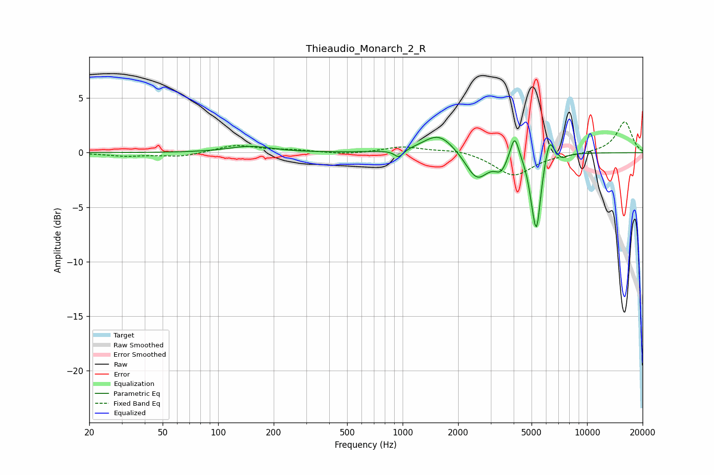

# Thieaudio_Monarch_2_R
See [usage instructions](https://github.com/jaakkopasanen/AutoEq#usage) for more options and info.

### Parametric EQs
Apply preamp of -1.5 dB when using parametric equalizer.

|   # | Type    |   Fc (Hz) |    Q |   Gain (dB) |
|-----|---------|-----------|------|-------------|
|   1 | Peaking |       149 | 1.22 |         0.6 |
|   2 | Peaking |       954 | 5.73 |        -0.7 |
|   3 | Peaking |      1575 | 1.64 |         1.8 |
|   4 | Peaking |      2527 | 2.31 |        -2.6 |
|   5 | Peaking |      3413 | 4.23 |        -1.3 |
|   6 | Peaking |      4048 | 5.98 |         2.3 |
|   7 | Peaking |      5015 | 6    |        -1.2 |
|   8 | Peaking |      5322 | 5.99 |        -6.4 |
|   9 | Peaking |      6251 | 5.93 |         2   |
|  10 | Peaking |      7368 | 5.49 |        -0.4 |

### Fixed Band EQs
When using fixed band (also called graphic) equalizer, apply preamp of **-2.9 dB** (if available) and set gains manually with these parameters.

|   # | Type    |   Fc (Hz) |    Q |   Gain (dB) |
|-----|---------|-----------|------|-------------|
|   1 | Peaking |        31 | 1.41 |        -0.3 |
|   2 | Peaking |        62 | 1.41 |        -0.4 |
|   3 | Peaking |       125 | 1.41 |         0.7 |
|   4 | Peaking |       250 | 1.41 |         0.2 |
|   5 | Peaking |       500 | 1.41 |        -0.2 |
|   6 | Peaking |      1000 | 1.41 |         0.5 |
|   7 | Peaking |      2000 | 1.41 |         0.3 |
|   8 | Peaking |      4000 | 1.41 |        -2.1 |
|   9 | Peaking |      8000 | 1.41 |        -0.1 |
|  10 | Peaking |     16000 | 1.41 |         2.9 |

### Graphs

