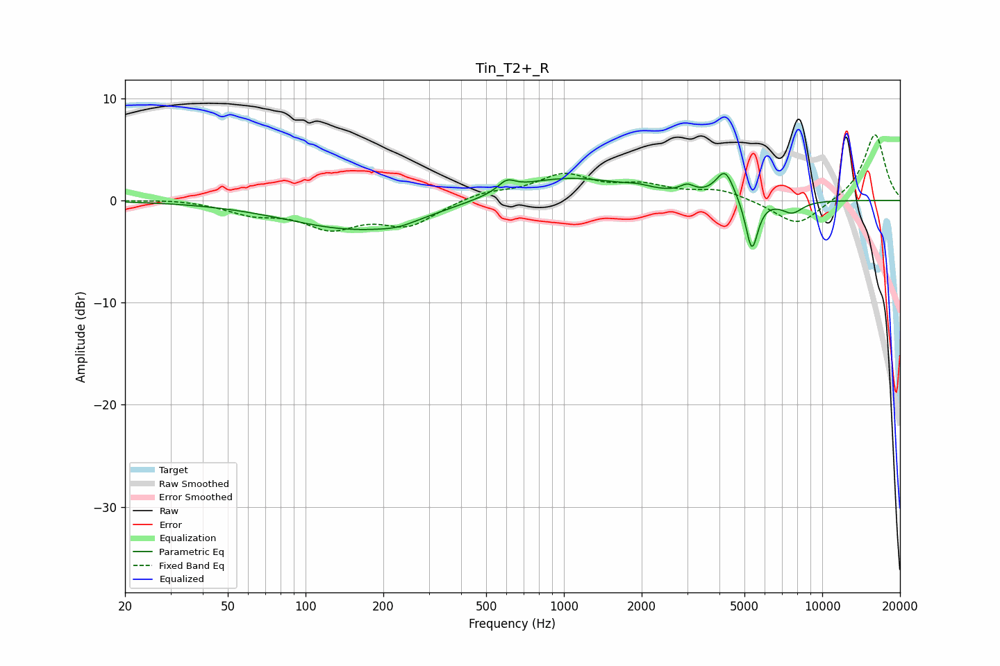

# Tin_T2+_R
See [usage instructions](https://github.com/jaakkopasanen/AutoEq#usage) for more options and info.

### Parametric EQs
Apply preamp of -2.7 dB when using parametric equalizer.

|   # | Type    |   Fc (Hz) |    Q |   Gain (dB) |
|-----|---------|-----------|------|-------------|
|   1 | Peaking |       160 | 0.52 |        -2.9 |
|   2 | Peaking |       228 | 2.02 |        -0.4 |
|   3 | Peaking |       601 | 4.28 |         1   |
|   4 | Peaking |      1007 | 0.6  |         2.3 |
|   5 | Peaking |      1925 | 2.84 |         0.3 |
|   6 | Peaking |      3002 | 5.07 |         0.8 |
|   7 | Peaking |      4207 | 3.97 |         2.8 |
|   8 | Peaking |      5279 | 4.12 |        -0.6 |
|   9 | Peaking |      5344 | 6    |        -4.6 |
|  10 | Peaking |      7640 | 3.17 |        -1.2 |

### Fixed Band EQs
When using fixed band (also called graphic) equalizer, apply preamp of **-6.5 dB** (if available) and set gains manually with these parameters.

|   # | Type    |   Fc (Hz) |    Q |   Gain (dB) |
|-----|---------|-----------|------|-------------|
|   1 | Peaking |        31 | 1.41 |         0.2 |
|   2 | Peaking |        62 | 1.41 |        -1.1 |
|   3 | Peaking |       125 | 1.41 |        -2.4 |
|   4 | Peaking |       250 | 1.41 |        -2.3 |
|   5 | Peaking |       500 | 1.41 |         0.8 |
|   6 | Peaking |      1000 | 1.41 |         2.4 |
|   7 | Peaking |      2000 | 1.41 |         1.2 |
|   8 | Peaking |      4000 | 1.41 |         1   |
|   9 | Peaking |      8000 | 1.41 |        -2.6 |
|  10 | Peaking |     16000 | 1.41 |         6.6 |

### Graphs

