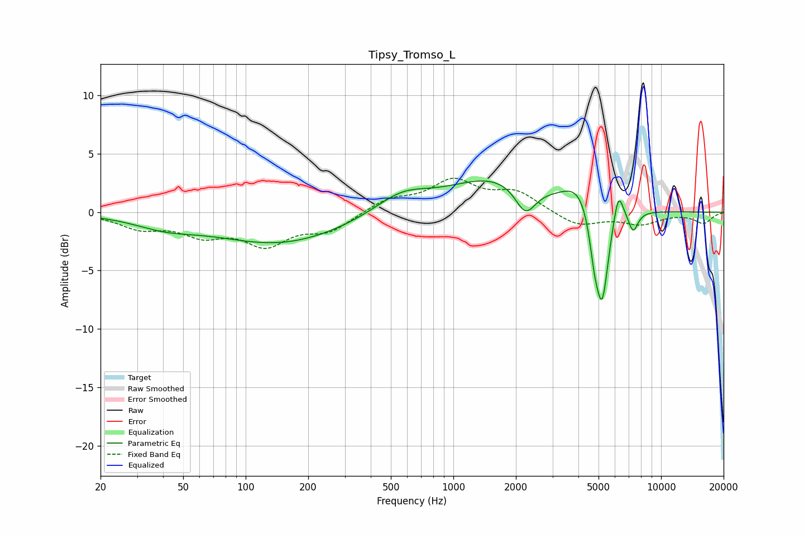

# Tipsy_Tromso_L
See [usage instructions](https://github.com/jaakkopasanen/AutoEq#usage) for more options and info.

### Parametric EQs
Apply preamp of -2.8 dB when using parametric equalizer.

|   # | Type    |   Fc (Hz) |    Q |   Gain (dB) |
|-----|---------|-----------|------|-------------|
|   1 | Peaking |        41 | 0.94 |        -0.9 |
|   2 | Peaking |       147 | 0.45 |        -2.7 |
|   3 | Peaking |       564 | 1.09 |         1.6 |
|   4 | Peaking |      1587 | 0.63 |         2.9 |
|   5 | Peaking |      2224 | 2.87 |        -2.5 |
|   6 | Peaking |      4010 | 1.86 |         2   |
|   7 | Peaking |      4764 | 6    |        -2.6 |
|   8 | Peaking |      5202 | 4.41 |        -8.1 |
|   9 | Peaking |      6231 | 5.95 |         2.6 |
|  10 | Peaking |      7343 | 5.9  |        -1.7 |

### Fixed Band EQs
When using fixed band (also called graphic) equalizer, apply preamp of **-3.0 dB** (if available) and set gains manually with these parameters.

|   # | Type    |   Fc (Hz) |    Q |   Gain (dB) |
|-----|---------|-----------|------|-------------|
|   1 | Peaking |        31 | 1.41 |        -1.2 |
|   2 | Peaking |        62 | 1.41 |        -1.7 |
|   3 | Peaking |       125 | 1.41 |        -2.5 |
|   4 | Peaking |       250 | 1.41 |        -1.5 |
|   5 | Peaking |       500 | 1.41 |         1.1 |
|   6 | Peaking |      1000 | 1.41 |         2.5 |
|   7 | Peaking |      2000 | 1.41 |         1.6 |
|   8 | Peaking |      4000 | 1.41 |        -1.2 |
|   9 | Peaking |      8000 | 1.41 |        -0.9 |
|  10 | Peaking |     16000 | 1.41 |        -0.9 |

### Graphs

