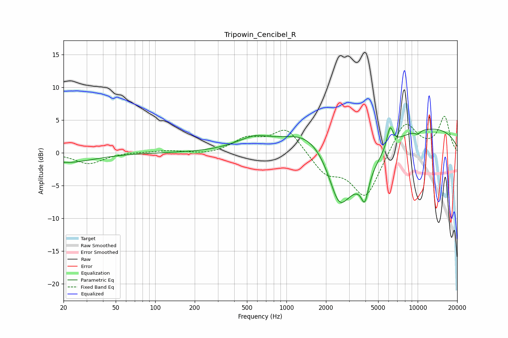

# Tripowin_Cencibel_R
See [usage instructions](https://github.com/jaakkopasanen/AutoEq#usage) for more options and info.

### Parametric EQs
Apply preamp of -3.9 dB when using parametric equalizer.

|   # | Type    |   Fc (Hz) |    Q |   Gain (dB) |
|-----|---------|-----------|------|-------------|
|   1 | Peaking |        21 | 0.7  |        -1.5 |
|   2 | Peaking |       559 | 0.97 |         1.8 |
|   3 | Peaking |       590 | 3.17 |         0.2 |
|   4 | Peaking |      1441 | 0.79 |         2.8 |
|   5 | Peaking |      2509 | 1.79 |        -7.1 |
|   6 | Peaking |      3596 | 0.87 |        -6.7 |
|   7 | Peaking |      3955 | 5.4  |        -3.6 |
|   8 | Peaking |      6152 | 6    |         3.1 |
|   9 | Peaking |      8651 | 0.2  |         4.3 |
|  10 | Peaking |     10000 | 6    |        -0.5 |

### Fixed Band EQs
When using fixed band (also called graphic) equalizer, apply preamp of **-5.7 dB** (if available) and set gains manually with these parameters.

|   # | Type    |   Fc (Hz) |    Q |   Gain (dB) |
|-----|---------|-----------|------|-------------|
|   1 | Peaking |        31 | 1.41 |        -1.7 |
|   2 | Peaking |        62 | 1.41 |         0.1 |
|   3 | Peaking |       125 | 1.41 |         0.3 |
|   4 | Peaking |       250 | 1.41 |        -0.3 |
|   5 | Peaking |       500 | 1.41 |         2   |
|   6 | Peaking |      1000 | 1.41 |         3.8 |
|   7 | Peaking |      2000 | 1.41 |        -3   |
|   8 | Peaking |      4000 | 1.41 |        -6.9 |
|   9 | Peaking |      8000 | 1.41 |         5.1 |
|  10 | Peaking |     16000 | 1.41 |         5.4 |

### Graphs

