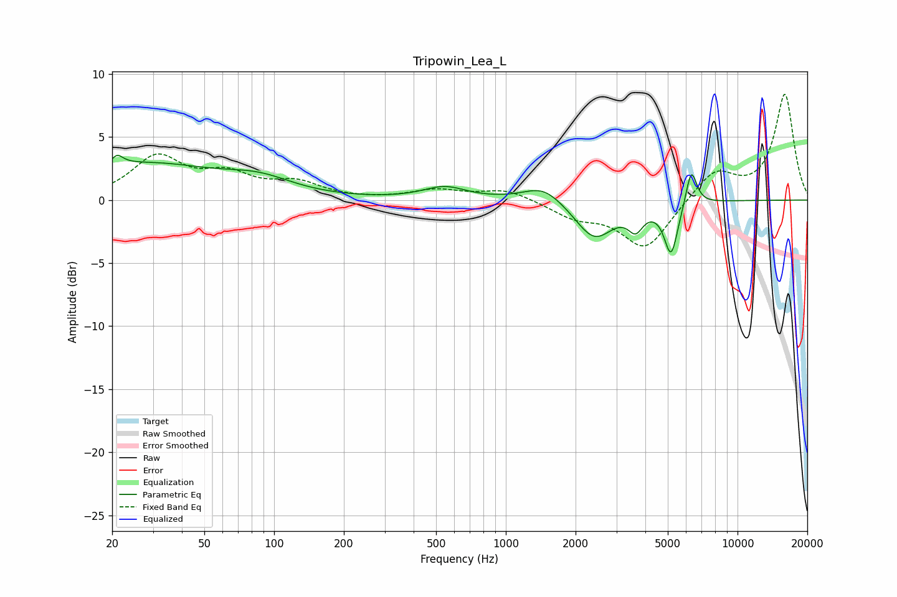

# Tripowin_Lea_L
See [usage instructions](https://github.com/jaakkopasanen/AutoEq#usage) for more options and info.

### Parametric EQs
Apply preamp of -3.6 dB when using parametric equalizer.

|   # | Type    |   Fc (Hz) |    Q |   Gain (dB) |
|-----|---------|-----------|------|-------------|
|   1 | Peaking |        21 | 5.8  |         3.3 |
|   2 | Peaking |        21 | 6    |        -2.4 |
|   3 | Peaking |        27 | 0.46 |         2.8 |
|   4 | Peaking |        86 | 0.96 |         1.2 |
|   5 | Peaking |       544 | 1.53 |         1   |
|   6 | Peaking |      1451 | 1.65 |         1.3 |
|   7 | Peaking |      2410 | 1.7  |        -3.1 |
|   8 | Peaking |      3633 | 4.36 |        -1.6 |
|   9 | Peaking |      5168 | 4.7  |        -4.1 |
|  10 | Peaking |      6315 | 5.86 |         2.9 |

### Fixed Band EQs
When using fixed band (also called graphic) equalizer, apply preamp of **-8.5 dB** (if available) and set gains manually with these parameters.

|   # | Type    |   Fc (Hz) |    Q |   Gain (dB) |
|-----|---------|-----------|------|-------------|
|   1 | Peaking |        31 | 1.41 |         3.3 |
|   2 | Peaking |        62 | 1.41 |         1.7 |
|   3 | Peaking |       125 | 1.41 |         1.2 |
|   4 | Peaking |       250 | 1.41 |        -0   |
|   5 | Peaking |       500 | 1.41 |         0.7 |
|   6 | Peaking |      1000 | 1.41 |         0.9 |
|   7 | Peaking |      2000 | 1.41 |        -1.2 |
|   8 | Peaking |      4000 | 1.41 |        -3.9 |
|   9 | Peaking |      8000 | 1.41 |         2.3 |
|  10 | Peaking |     16000 | 1.41 |         8.4 |

### Graphs

