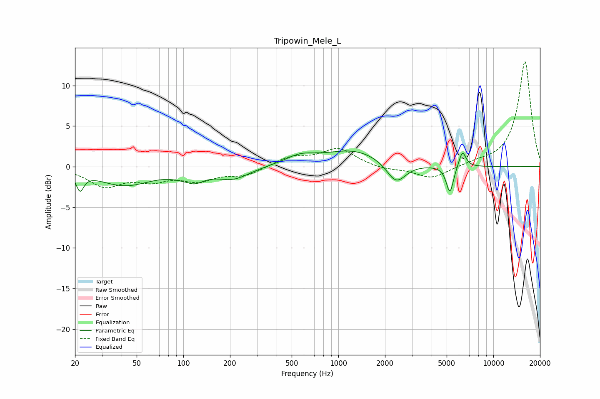

# Tripowin_Mele_L
See [usage instructions](https://github.com/jaakkopasanen/AutoEq#usage) for more options and info.

### Parametric EQs
Apply preamp of -2.0 dB when using parametric equalizer.

|   # | Type    |   Fc (Hz) |    Q |   Gain (dB) |
|-----|---------|-----------|------|-------------|
|   1 | Peaking |        22 | 5.99 |        -2.1 |
|   2 | Peaking |        42 | 0.82 |        -2.2 |
|   3 | Peaking |       107 | 3.09 |         0.7 |
|   4 | Peaking |       112 | 2.07 |        -1.9 |
|   5 | Peaking |       211 | 1.36 |        -1.4 |
|   6 | Peaking |       567 | 1.46 |         1   |
|   7 | Peaking |      1267 | 0.72 |         2   |
|   8 | Peaking |      2360 | 2.23 |        -2.7 |
|   9 | Peaking |      5247 | 6    |        -3.4 |
|  10 | Peaking |      6317 | 5.99 |         2.1 |

### Fixed Band EQs
When using fixed band (also called graphic) equalizer, apply preamp of **-13.0 dB** (if available) and set gains manually with these parameters.

|   # | Type    |   Fc (Hz) |    Q |   Gain (dB) |
|-----|---------|-----------|------|-------------|
|   1 | Peaking |        31 | 1.41 |        -2.3 |
|   2 | Peaking |        62 | 1.41 |        -1.4 |
|   3 | Peaking |       125 | 1.41 |        -1.5 |
|   4 | Peaking |       250 | 1.41 |        -1   |
|   5 | Peaking |       500 | 1.41 |         1.2 |
|   6 | Peaking |      1000 | 1.41 |         2.2 |
|   7 | Peaking |      2000 | 1.41 |        -0.4 |
|   8 | Peaking |      4000 | 1.41 |        -1.5 |
|   9 | Peaking |      8000 | 1.41 |         0.4 |
|  10 | Peaking |     16000 | 1.41 |        13   |

### Graphs

