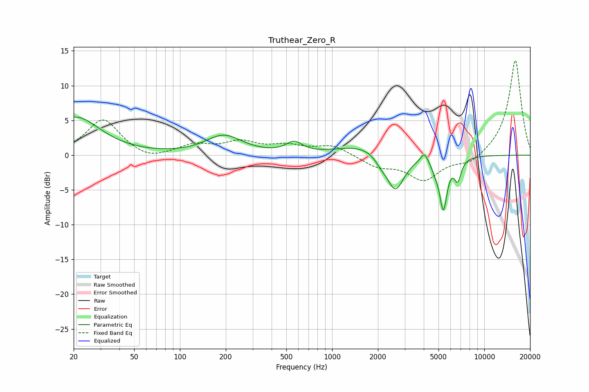

# Truthear_Zero_R
See [usage instructions](https://github.com/jaakkopasanen/AutoEq#usage) for more options and info.

### Parametric EQs
Apply preamp of -5.6 dB when using parametric equalizer.

|   # | Type    |   Fc (Hz) |    Q |   Gain (dB) |
|-----|---------|-----------|------|-------------|
|   1 | Peaking |        21 | 0.89 |         5.4 |
|   2 | Peaking |       194 | 1.19 |         2.7 |
|   3 | Peaking |       562 | 2.71 |         1.5 |
|   4 | Peaking |      1608 | 0.87 |         1.5 |
|   5 | Peaking |      2089 | 4    |        -0.8 |
|   6 | Peaking |      2599 | 2.41 |        -5.5 |
|   7 | Peaking |      4037 | 5.92 |         1.4 |
|   8 | Peaking |      4760 | 5.8  |        -1   |
|   9 | Peaking |      5381 | 5.64 |        -7.3 |
|  10 | Peaking |      6693 | 6    |        -3   |

### Fixed Band EQs
When using fixed band (also called graphic) equalizer, apply preamp of **-13.7 dB** (if available) and set gains manually with these parameters.

|   # | Type    |   Fc (Hz) |    Q |   Gain (dB) |
|-----|---------|-----------|------|-------------|
|   1 | Peaking |        31 | 1.41 |         5.2 |
|   2 | Peaking |        62 | 1.41 |        -1   |
|   3 | Peaking |       125 | 1.41 |         1.3 |
|   4 | Peaking |       250 | 1.41 |         1.7 |
|   5 | Peaking |       500 | 1.41 |         1.2 |
|   6 | Peaking |      1000 | 1.41 |         1.4 |
|   7 | Peaking |      2000 | 1.41 |        -1.5 |
|   8 | Peaking |      4000 | 1.41 |        -3.5 |
|   9 | Peaking |      8000 | 1.41 |        -1.3 |
|  10 | Peaking |     16000 | 1.41 |        13.8 |

### Graphs

