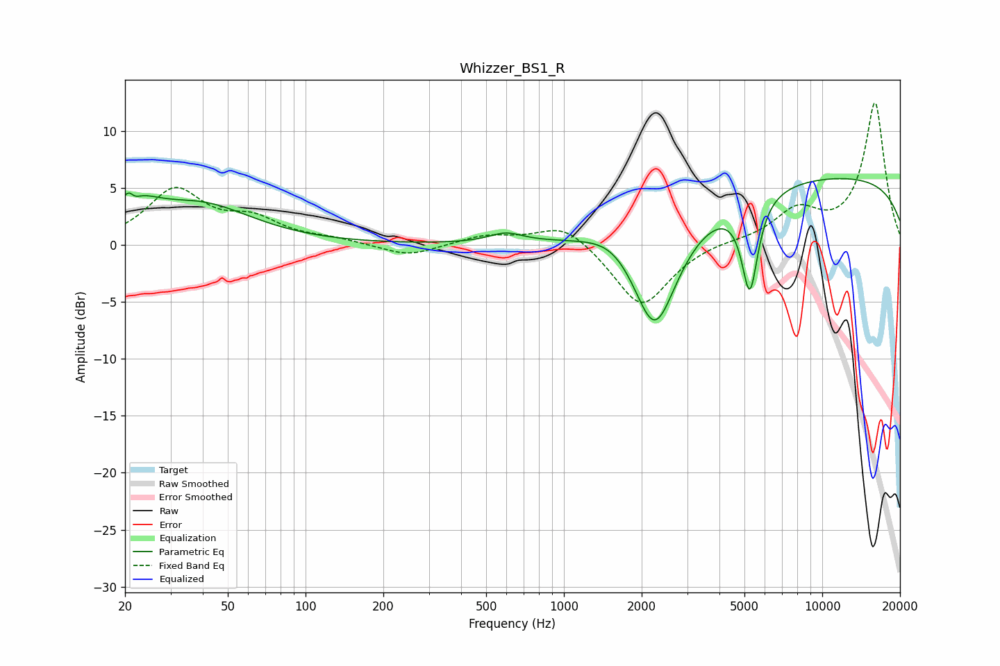

# Whizzer_BS1_R
See [usage instructions](https://github.com/jaakkopasanen/AutoEq#usage) for more options and info.

### Parametric EQs
Apply preamp of -5.9 dB when using parametric equalizer.

|   # | Type    |   Fc (Hz) |    Q |   Gain (dB) |
|-----|---------|-----------|------|-------------|
|   1 | Peaking |        21 | 5.42 |         2.9 |
|   2 | Peaking |        21 | 5.89 |        -2.2 |
|   3 | Peaking |        23 | 1.64 |         2   |
|   4 | Peaking |        39 | 0.71 |         3.3 |
|   5 | Peaking |       596 | 2.15 |         0.8 |
|   6 | Peaking |      1550 | 1.3  |        -1.2 |
|   7 | Peaking |      1578 | 1.31 |         2.7 |
|   8 | Peaking |      2247 | 1.52 |       -10.5 |
|   9 | Peaking |      5244 | 4.33 |        -8.3 |
|  10 | Peaking |     10000 | 0.18 |         6.1 |

### Fixed Band EQs
When using fixed band (also called graphic) equalizer, apply preamp of **-12.5 dB** (if available) and set gains manually with these parameters.

|   # | Type    |   Fc (Hz) |    Q |   Gain (dB) |
|-----|---------|-----------|------|-------------|
|   1 | Peaking |        31 | 1.41 |         4.7 |
|   2 | Peaking |        62 | 1.41 |         1.9 |
|   3 | Peaking |       125 | 1.41 |         0.4 |
|   4 | Peaking |       250 | 1.41 |        -1.1 |
|   5 | Peaking |       500 | 1.41 |         0.8 |
|   6 | Peaking |      1000 | 1.41 |         2   |
|   7 | Peaking |      2000 | 1.41 |        -5.6 |
|   8 | Peaking |      4000 | 1.41 |         0.3 |
|   9 | Peaking |      8000 | 1.41 |         2.8 |
|  10 | Peaking |     16000 | 1.41 |        12.4 |

### Graphs

